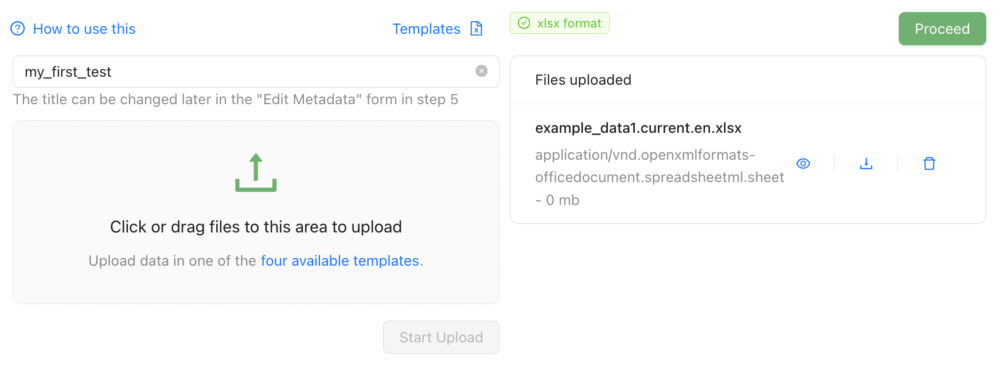
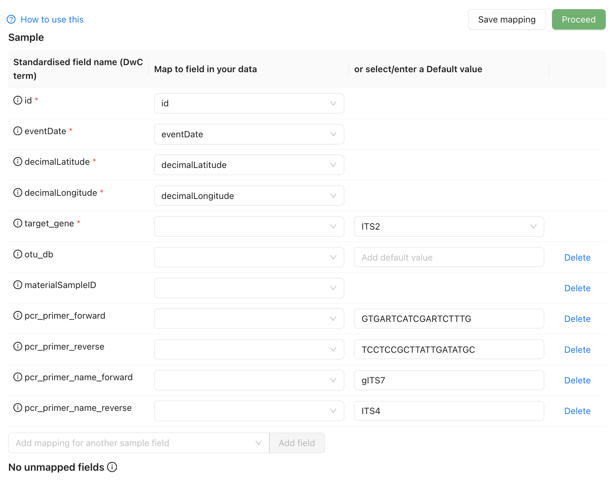
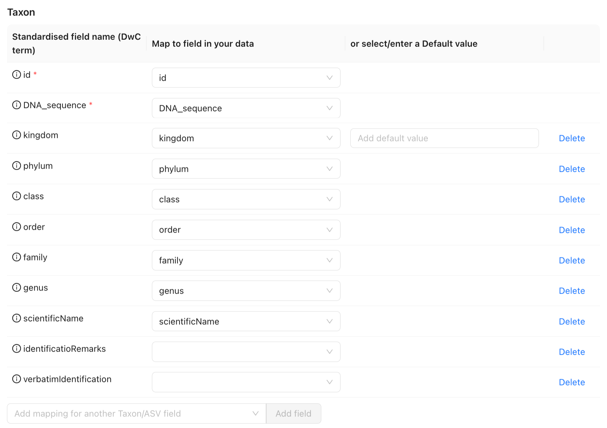
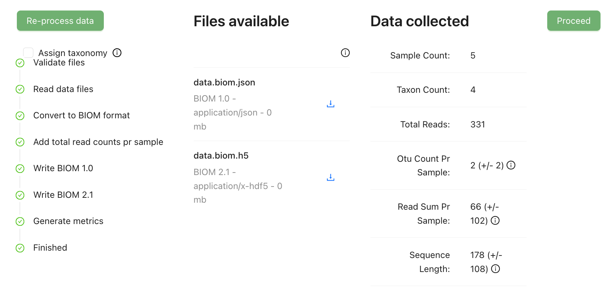
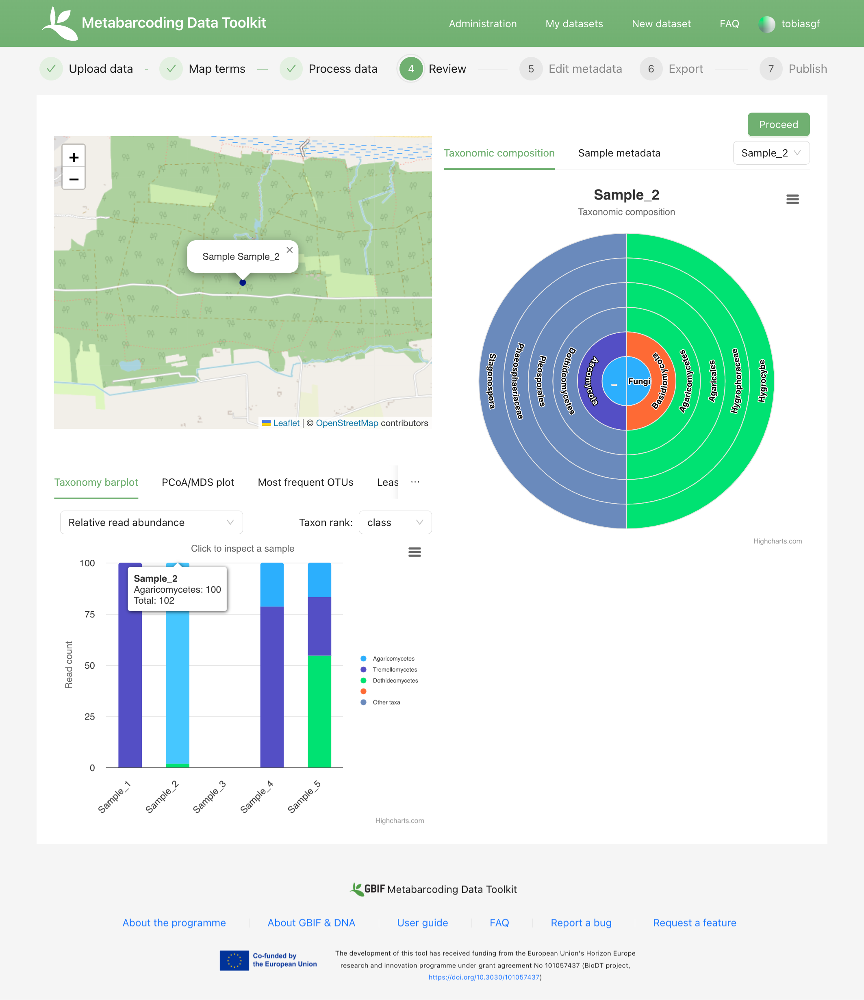
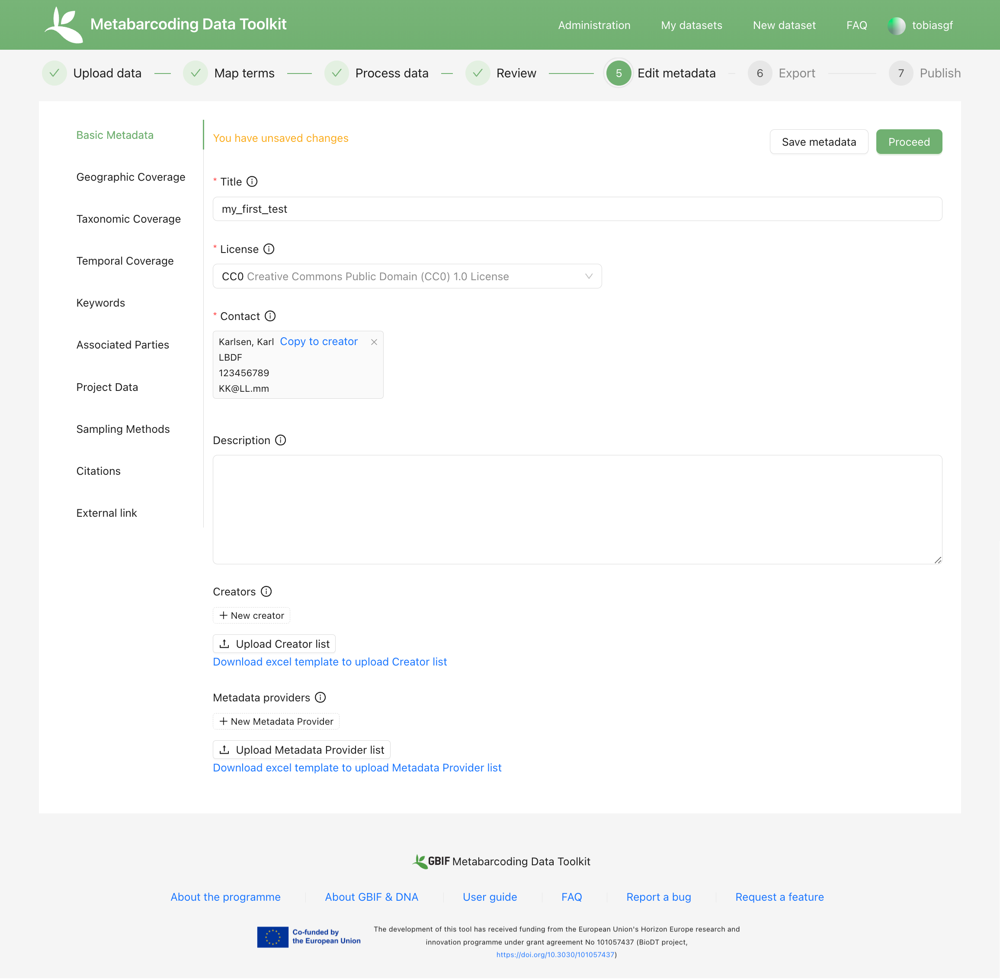
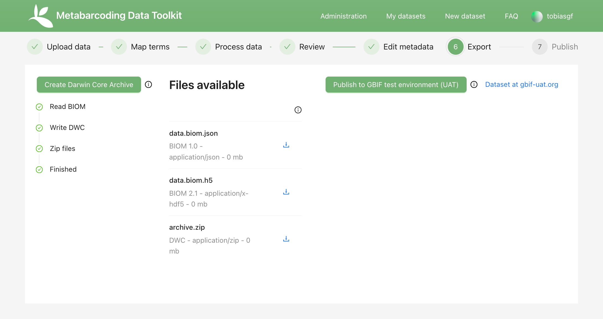
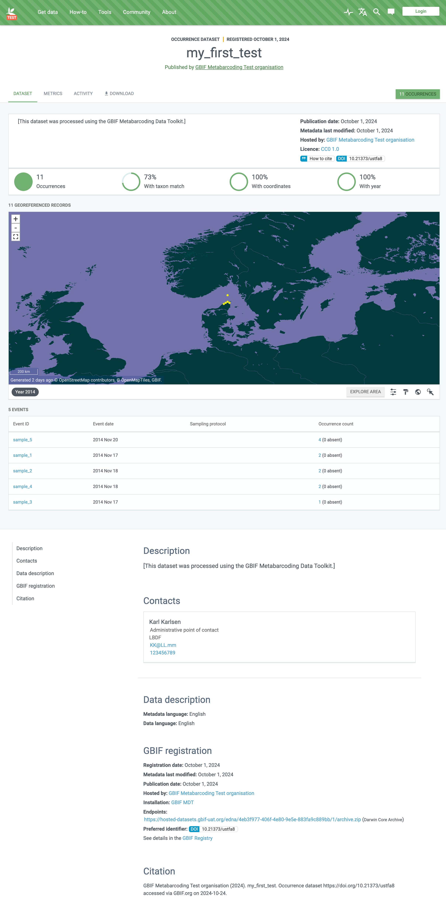
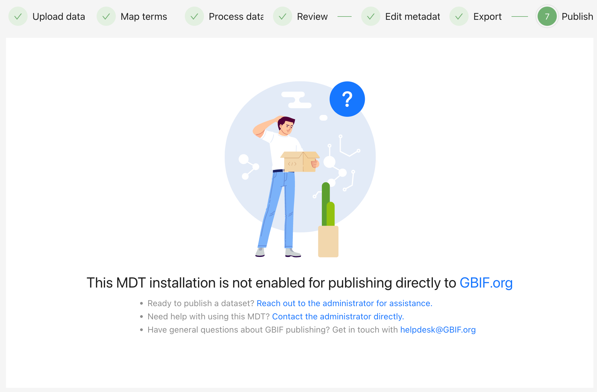

[[simple_quick_start]]
== Simple Quick Start Guide

A Simple Quick Start Guide with minimal explanation.

IMPORTANT: This guide assumes that you are using the https://mdt.gbif-test.org/[MDT Sandbox (Demo Installation)]. Please note that datasets in this environment are deleted weekly; therefore, avoid uploading important data without a backup.

This guide uses a _minimal dummy dataset_ – not to be used as a model for real data. The dataset is based on <<template1, template 1>>

. Download link:../example_data/example_data1.current.en.xlsx[Example Dataset 1].
. (Optional) Explore the structure of the example data in e.g. Microsoft Excel.
* The Excel Workbook has four sheets: *OTU_table*, *Taxonomy*, *Samples* and *Study*.
**  *OTU_table* is the OTU table, with sample IDs as column headers, OTU IDs as row names, and sequence read counts in the cells.
** *Taxonomy* links OTU IDs (from OTU_table) to sequence and taxonomic info.
** *Samples* links sample IDs (from OTU_table) to sample metadata: e.g. spatiotemporal information, protocols etc.
** *Study* holds global values for the dataset, such as barcoding region, primer sequences, and primer names.

[discrete]
=== Upload data (step 1)

. Go to https://mdt.gbif-test.org/[MDT Sandbox (Demo Installation)] and log in.
. Press *New Dataset* in the upper part of the page to go to the first step (Upload data).

[start=3]
. Drag and drop the dataset OR click and select on your computer.
. Give it a nickname – e.g. "my_first_test".
. Press *Start Upload*.

[start=6]
. Press *Proceed*

[discrete]
=== Map terms (step 2)

The user specifies and verifies how field names of uploaded data (second and third column on the page) correspond to standardized terms (first column on the page).

NOTE: Example dataset 1 uses standard terms (Darwin Core terms) as field names, and no manual mapping required.

TIP: *How to use this form* for a guided tour.

.The first section (*Sample*) concerns the mapping of metadata associated with samples. The MDT has automatically mapped four fields from the uploaded *Samples* table and five fields from the *Study* table to their identically named Darwin Core counterparts, e.g. the field with sampling dates in the samples table is called _eventDate_ in the uploaded data corresponding exactly (spelling) to the Darwin Core term term:dwc[eventDate], and the field with the term _pcr_primer_forward_ in the Study table is identical to the term term:mixs[pcr_primer_forward].

.The second section (*Taxon*) concerns the mapping of metadata associated with the OTUs, i.e. taxonomy and sequence related information. Similar to above, the MDT has automatically mapped all fields from the uploaded *Taxonomy* table to identically named Darwin Core terms.

Press *Proceed* to save mapping and proceed.

[discrete]
=== Process data (step 3)

. Press *Process data*.

NOTE: *Assign taxonomy* uses the https://www.gbif.org/tools/sequence-id[GBIF Sequence ID tool^] to assign taxonomy to the sequences. This overwrites any taxonomy provided. We will not use that option here.

.Pressing *Process data* generates standardized intermediate files (in BIOM format) and some data stats/metrics.

[start=2]
. Press *Proceed*

[discrete]
=== Review (step 4)

At this step, data is reviewed to ensure that everything looks OK.

.*Review* and verify that the data looks as expected. E.g.: Check the geolocation in the map (here: northern part on Denmark); Check taxonomic composition in the barcharts; Check ordination plots (PCoA/MDS) for outliers (e.g. control samples not excluded); Select single samples from map, charts or dropdown to explore metadata and taxonomic multilevel piecharts in the panel to the right.

Press *Proceed*.

[discrete]
=== Add metadata (step 5)

At this step, information on the dataset is provided.

.*Dataset information* – Notice how the left panel offers several sections of dataset information/metadata. *NB: For real datasets it is important to provide rich and meaningful data at this step*.

. Add a title to replace nickname – e.g. “my first simple test dataset”.
. Select a licence.
. Add contact information - minimum: email.
. Leave the other fields empty (as this is just a test).
. Press *Proceed* to save the metadata and proceed.

[discrete]
=== Export (step 6)

At this step, a <<dwc-a>> file is produced, which can be published to GBIF. In the https://mdt.gbif-test.org/[MDT Sandbox (Demo Installation)], the archive can (only!) be published to the GBIF *test* environment (UAT) for users to preview a potential GBIF.org publication.

. Press *Create Darwin Core Archive*.to generate a <<dwc-a>>.
. Press *Publish to GBIF test environment (UAT)*.

.Pressing *Create Darwin Core Archive* generates a <<dwc-a>> from the data through several steps – each marked with a green check as successful. *Publish to GBIF test environment (UAT)* registers ("publishes") the dataset in the GBIF test environment. NB: A notification indicates that it may take a few minutes before the indexing is complete. A link to the "preview" appears next to the Publish button.

[start=3]
. Click on the hyperlink *Dataset at gbif-uat.org*.

.Pressing *Dataset at gbif-uat.org* opens the dataset in the GBIF test environment (UAT) where users can see what a real publication would look like and verify that the processed dataset (<dwc-a>) contains all the wanted information for real publication. NB: The dataset is not completely indexed immediately and the dataset may e.g. have 0 occurences and no map compared to this figure, until fully indexed. Notice how the hatched/shaded header and the red "TEST" label indicate that this is a test environment. Explore the dataset and notice how the uploaded data and dataset information/description is presented on the website.  

[start=4]
. Go back to the MDT.
. Press on *Publish* (directly in the header with the 7 steps).

[discrete]
=== Publish (step 7)

You should now have a basic idea of how the MDT works.

If using this quick start guide as suggested, you will be using the https://mdt.gbif-test.org/[MDT Sandbox (Demo Installation)]. The publishing step (step 7) is *not enabled* for the this MDT, and step 7 will appear as in the figure below. Read about the publishing step in the <<detailed_guidance>>.

.The *Publish* step is not enabled for the https://mdt.gbif-test.org/[MDT Sandbox (Demo Installation)]. If you by chance prepared a real dataset using the https://mdt.gbif-test.org/[MDT Sandbox (Demo Installation)], it is recommended to redo the processing in a proper MDT installation, unless this would for some reason be too problematic. In that case you can use the link on the page: "Ready to publish a dataset? Reach out to the administrator for assistance".

 

<<<