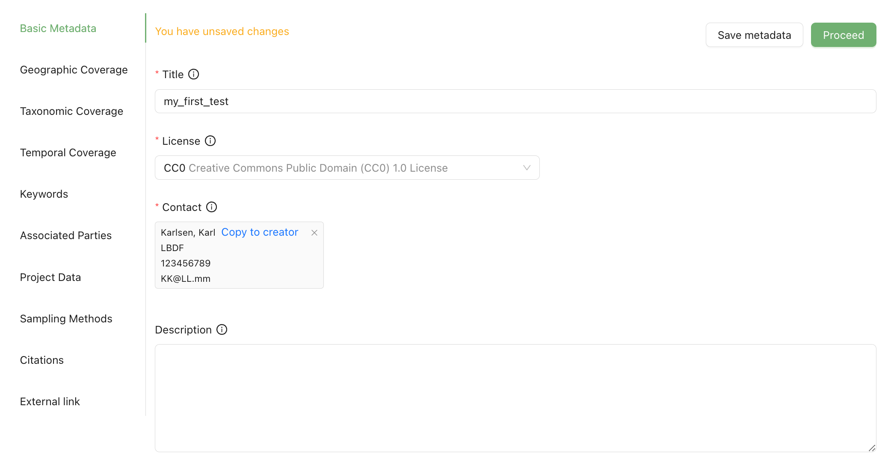
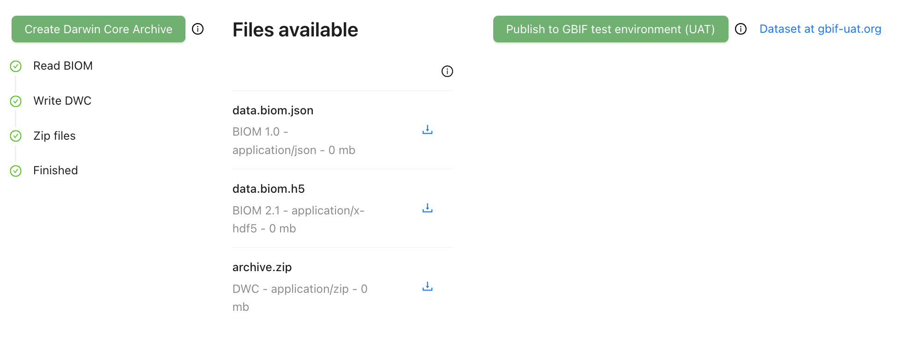

[[simple_quick_start]]
== Simple Quick Start Guide

A Simple Quick Start Guide with minimal explanation.

IMPORTANT: This guide assumes that you are using the demo version of the MDT, where log-in is with *credentials for the GBIF test environment (UAT)*.

=== Simple example dataset

NOTE: Minimal dummy dataset, not a model for real data. Based on <<template1, template 1>>

. Download link:../example_data/example_data1.current.en.xlsx[Example Dataset 1].
. (Optional) Explore the structure of the example data in e.g. Microsoft Excel.
* The Excel Workbook has four sheets: *OTU_table*, *Taxonomy*, *Samples* and *Study*.
**  *OTU_table* is the OTU table, with sample IDs as column headers, OTU IDs as row names, and sequence read counts in the cells.
** *Taxonomy* links OTU IDs (from OTU_table) to sequence and taxonomic info.
** *Samples* links sample IDs (from OTU_table) to sample metadata: e.g. spatiotemporal information, protocols etc.
** *Study* holds global values for the dataset, such as barcoding region, primer sequences, and primer names.

=== Upload data (step 1)

. Go to https://edna-tool.gbif-uat.org/[MDT demo^] and log in.
. Press *New Dataset* in the upper part of the page to go to the first step (Upload data).

[start=3]
. Drag and drop the dataset OR click and select on your computer.
. Give it a nickname – e.g. "my_first_test".
. Press *Start Upload*.

[start=4]
. Press *Proceed*

=== Map terms (step 2)

At this step, mapping of the fields is specified – i.e. indicate the field names of uploaded data correspond to Darwin Core terms.

NOTE: Example dataset 1 uses Darwin Core terms as field names, no manual mapping required.  

TIP: *how to use this form* for a guided tour.

.*Sample* – the first section concerns the mapping of sample data fields to Darwin Core terms (first column). The MDT has automatically mapped four fields from the *Samples* table (second column) and five fields from the *Study* table (third column) to their identically named Darwin Core counterparts: e.g. the field with sampling dates is called _eventDate_ in the uploaded data corresponding exactly to the Darwin Core term term:dwc[eventDate], and the field _pcr_primer_forward_ corresponds to the term term:mixs[pcr_primer_forward]).

.*Taxon* – the second section concerns the mapping of taxonomy and sequence related information. Similar to above, the MDT has automatically mapped four fields from the *Taxonomy* table to identically named Darwin Core terms.
image::img/simple_mapping_taxon.png[]

. Press *Proceed* to save mapping and proceed.

=== Process data (step 3)

NOTE: *assign taxonomy* uses the https://www.gbif.org/tools/sequence-id[GBIF Sequence ID tool^] to assign taxonomy to the sequences. This overwrites any taxonomy provided. We will not use that option here.

. Press *Process data*.

.*Process data* – standardized intermediate files (in BIOM) and some calculated metrics are generated.

[start=2]
. Press *Proceed*

=== Review (step 4)

At this step, data is reviewed to ensure that everything looks OK.

.The processed data can be explored and reviewed to ensure that everything looks as expected – Check the geolocation in the map (here: northern part on Denmark); Check the taxonomic composition in the barcharts; Check ordination plots (PCoA/MDS) for outliers (e.g. control samples not excluded); Select samples from the map or charts and explore metadata and taxonomy in the panel to the right.
image::img/simple_review.png[]

. Press *Proceed*.

=== Add metadata (step 5)

At this step, information on the dataset is provided.

.*Add metadata* – Notive how there a several sections with metadata (left panle with section headers). For real datasets it is important to provide rich and meaningful data at this step.

. Add a title to replace nickname – e.g. “my first simple test dataset”.
. Select a licence.
. Add contact information - minimum: email.
. Leave the other fields empty.
. Press *Proceed*.

=== Export (step 6)

At this step, the so-called <<dwc-a>> is produced. This is file type that can be indexed by (published through) GBIF. In the MDT demo installation, the archive can be published directly to the GBIF test environment (UAT) to see how a real GBIF publication would look like.

. Press *Create DWC archive*.to generate a <<dwc-a>>.
. Press *Publish to GBIF test environment (UAT)*.

.*Export* – *Create DWC archive* generates a <<dwc-a>> from the data through several steps, each marked with a green check as successful. *Publish to GBIF test environment (UAT)* will register the dataset (<<dwc-a>>) in the GBIF test environment. A notification indicates that it may take a few minutes before the indexing is complete. A link to the "test dataset" appears next to the Publish button.

[start=3]
. Click on the hyperlink *Dataset at gbif-uat.org* to explore the dataset in the GBIF test environment (UAT). Go back to the MDT. (come back later when the indexing is complete)
. Click on your username in the top right. Here you can:
** Logout.
** Access all your datasets, e.g. to: 
*** See them in the test environment (UAT).
*** Revise and update dataset and export/publish new versions.

You should now have a basic idea of how the MDT works.

<<<