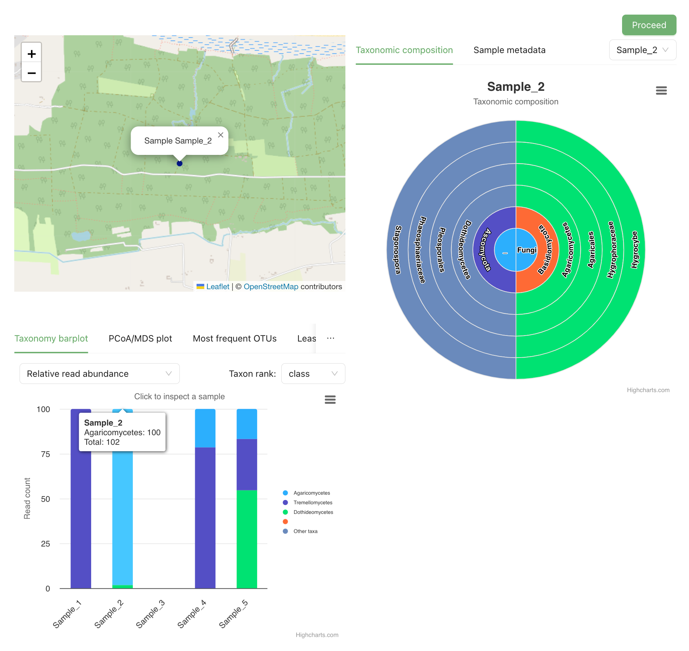

[[simple_quick_start]]
== Simple Quick Start Guide

A Simple Quick Start Guide with minimal explanation.

IMPORTANT: This guide assumes that you are using the demo version of the MDT, where log-in is with *credentials for the GBIF test environment (UAT)*.

=== Simple example dataset

NOTE: Minimal dummy dataset, not a model for real data. Based on <<template1, template 1>>

. Download link:../example_data/example_data1.current.en.xlsx[Example Dataset 1].
. (Optional) Explore the structure of the example data in e.g. Microsoft Excel.
* The Excel Workbook has four sheets: *OTU_table*, *Taxonomy*, *Samples* and *Study*.
**  *OTU_table* is the OTU table, with sample IDs as column headers, OTU IDs as row names, and sequence read counts in the cells.
** *Taxonomy* links OTU IDs (from OTU_table) to sequence and taxonomic info.
** *Samples* links sample IDs (from OTU_table) to sample metadata: e.g. spatiotemporal information, protocols etc.
** *Study* holds global values for the dataset, such as barcoding region, primer sequences, and primer names.

=== Upload data (step 1)

. Go to https://edna-tool.gbif-uat.org/[MDT demo^] and log in.
. Press *New Dataset* in the upper part of the page.

image::img/general_step_bar.png[]

. Drag and drop the dataset OR click and select on your computer.
. Give it a nickname – e.g. "my_first_test".
. Press *Start Upload*.
+
A green icon indicates that XLSX format is detected and OK.

image::img/simple_upload.png[]

[start=4]
. Press *Proceed*

=== Map terms (step 2)

Specify the mapping of the fields – i.e. indicate how the field names correspond to Darwin Core terms.

TIP: *how to use this form* for a guided tour.

NOTE: Example dataset 1 uses Darwin Core terms as field names, no manual mapping required.  

. (Optional) Inspect mapping.

.*Sample* – the first section concerns the mapping of sample data fields to Darwin Core terms (first column). The MDT has automatically mapped four fields from the *Samples* table (second column) and five fields from the *Study* table (third column) to their identically named Darwin Core counterparts: e.g. the field with sampling dates is called _eventDate_ in the uploaded data corresponding exactly to the Darwin Core term term:dwc[eventDate], and the field _pcr_primer_forward_ corresponds to the term term:mixs[pcr_primer_forward]).
image::img/simple_mapping_sample.png[]

.*Taxon* – the second section concerns the mapping of taxonomy and sequence related information. Similar to above, the MDT has automatically mapped four fields from the *Taxonomy* table to identically named Darwin Core terms.
image::img/simple_mapping_taxon.png[]

. Press *Proceed* to save mapping and proceed.

=== Process data (step 3)

NOTE: *assign taxonomy* uses the https://www.gbif.org/tools/sequence-id[GBIF Sequence ID tool^] to assign taxonomy to the sequences. This overwrites any taxonomy provided. We will not use that option here.

. Press *Process data*.

.*Process data* – standardized intermediate files (in BIOM) and some calculated metrics are generated.
image::img/simple_processing.png[]

[start=2]
. Press *Proceed*

=== Review (step 4)

At this step the processed data can be explored and reviewed to verify that everything is OK, e.g. ensure that control samples are not included as samples, and that the mapping is as expected.

. (_Optional_) Review the data.
** Check the map and verify that the samples are placed geographically where expected (Northern part on Denmark). 
** Check the taxonomic barchart to ensure that taxonomic composition is as expected.
** Check ordination plots (PCoA/MDS) for outliers (e.g. control samples that were not excluded).
** Select single samples from the map or chart and explore their metadata and taxonomy in the panel to the right.

[start=2]
. Press *Proceed*.

=== Add metadata (step 5)

In this step, information on the dataset (dataset metadata) is provided. Mandatory fields must be completed in order to proceed. Here we ignore the remaining fields.

. Add a meaningful title (e.g. “my first test dataset”).
. Select a licence.
. Add contact information - minimum: email.
. Leave the other fields empty.

image::img/simple_metadata.png[]

[start=5]
. Press *Proceed*.

=== Export (step 6)

At this step, the so-called <<dwc-a>> is produced. It can be published directly to the GBIF test environment (UAT) from the MDT.

. Press *Create DWC archive*.
+
This process generates the <<dwc-a>> from the data, progressing through several steps, each marked with a green check if successful.
. Press *Publish to GBIF test environment (UAT)*.
+
A notification will indicate that data ingestion may take a few minutes before all samples appear in the GBIF test environment (UAT). A link to the dataset in the test environment (UAT) will appear next to the Publish button.
. (Optional) Click on the hyperlink *Dataset at gbif-uat.org*.
.. Explore the dataset in the GBIF test environment (UAT)
.. Go back to the MDT 
. Click on your username in the top right. Here you can:
** Logout.
** Access your datasets, e.g. to: 
*** See them in the test environment (UAT).
*** Revise and update dataset and export/publish new versions.

You should now have a basic idea of how the MDT works. Continue with the <<advanced_quick_start>> to learn more.
