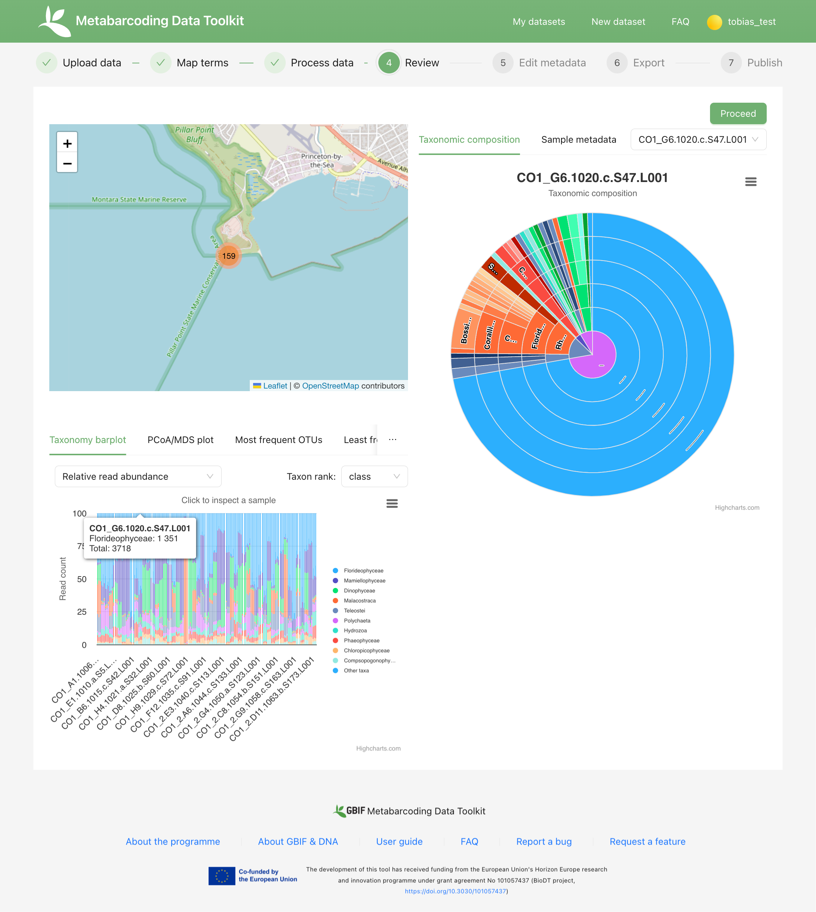

[[advanced_quick_start]]
== Advanced Quick Start Guide

This advanced quick start guide handles the processing of a realistic example dataset with more detailed explanations of the steps involved.

=== Advanced example dataset

This quide uses a real metabarcoding dataset of surface seawater metazoan communities. The dataset has been modified to better illustrate some features of the MDT. 

NOTE: The dataset was formatted for publishing to OBIS, and thus OTUs (sequences) identified to organisms not on the WoRMS checklist are provided with unspecified taxonomy (i.e. "Incertae sedis"). Read a more detailed description of the dataset <<example2, here>>. You may explored the dataset in the MDT https://mdt.gbif-uat.org/dataset/3d4e6748-df68-4047-ab04-ac3c3baa7840/review[here].

. Download link:../example_data/example_data2.current.en.xlsx[example_dataset_2].
. Save the file to your computer.
. Explore the structure of the example data in Excel or another app.
** The *OTU_table*. Column headers (_CO1_A1.1006.a.S1.L001, CO1_A3.1006.c.S17.L001, CO1_A2.1006.b.S9.L001, CO1_B3.1007.c.S18.L001, etc._) are the IDs of the 159(160) samples in the dataset. Row names (_merged_CO1_1, merged_CO1_2, merged_CO1_3, etc._) are IDs of the 24744 OTUs. Cells contain sequence read counts. (NB: the 160th column contains a negative control sample _NEG_ that we do not want to include in the final data)
** The *Taxonomy* table contains the IDs of the OTUs referring to the rownames in the *OTU_table* along with the sequence, and taxonomic information derived from comparing the sequences against NCBI GenBank. Notice how many OTUs have not been possible to identify (or match to a species in the WoRMS Checklist) and are simply named "Incertae sedis" (uncertain placement). 
** The *Samples* table contains the IDs of the samples referring to the column names in the *OTU_table* table, and some sample metadata: spatiotemporal data, date, etc. Some fields are using DwC terms others are not yet standardized. (NB: The negative control sample _NEG_ has been removed from this table)
** The *Study* table contains sample or study level information that is the same for the whole dataset - e.g.: primer information, sequencing platform.

NOTE: The 160th column of the OTU table corresponds to a negative control sample (NEG), which should be excluded from the final dataset. The MDT will automatically remove any samples that are not present in both the *Samples* and *OTU_table* tables. Since the negative control has already been removed from  *Samples*, it will not be included in the final dataset.

=== Log in

IMPORTANT: This guide assumes that you are using the demo version of the MDT.

. Go to the website of the https://edna-tool.gbif-uat.org/[MDT demo^]. (alternatively use another installation of the MDT)
. Log in with your *UAT login*. (use GBIF login for any other installation of the MDT).
. Press *New Dataset*.

=== Upload data (step 1)

. Drag the example dataset to the upload area, or click and select the file.
. Give the dataset a nickname (e.g. "my_advanced_test").
. Press *Start Upload*.
+
A green icon will indicate that the XLSX format is detected and OK.

You will get a warning that one of the columns (samples) in the OTU table does not have a corresponding row in the sample table. We knew that, and it is OK (see above).

image::img/advanced_example_upload.png[]

[start=4]
. Open the data viewer by clicking on the eye icon next to the uploaded dataset.
. View and verify the structure and content of the four tables corresponding to the four sheets in the uploaded Excel Workbook.
. Close the viewer by pressing *Back*.
. Press *Proceed*.

=== Map terms (step 2)

In this step, you define the mapping of fields from the uploaded data, specifying how each field corresponds to the appropriate Darwin Core terms

TIP: Press *how to use this form* to get a guided tour of this page.

TIP: Press *Save mapping* once in a while to make sure that you do not get logged out and lose your work.

*First inspection*

. Inspect the overall structure and information on the page.
.. The upper section named *Samples* maps our sample data fields to Darwin Core terms (first column), automatically identifying and mapping four fields from the *Samples* table (second column) and five global fields from the *Study* table (third column) with their identically named Darwin Core counterparts.
.. The second section named *Taxon* does the same for taxonomic and sequence related information, auto-mapping four fields from the *Taxonomy* table to identically named Darwin Core fields.
.. The last section *Unmapped fields* lists all the fields in the uploaded data, that has names the tool do not easily recognize. Below there is an option to put unmapped fields into so-called *Extended Measurement Or Facts*.
. Press "Save Mapping" and see how you get a warning about how some essential fields have not ben mapped.

image::img/advanced_mapping.png[]

*Completing the mapping*

Starting from the top with *Sample* information, we see:

[start=3]
. Notice how the field `id` was correctly identified and mapped.
. Notice the fields from the *Samples* table in the uploaded data _eventDate, locationID, geodeticDatum, verbatimEventDate,_ and _associatedSequences_ – shown in the second column of the MDT mapping page – were automatically mapped to identically named Darwin Core terms in the first colum. 
. term:dwc[decimalLatitude] and term:dwc[decimalLatitude] were not mapped automatically, but it is suggested to use _Latitude_ and _Longitude_.
.. click on _Latitude_ and _Longitude_ to map them.
. Notice the many fields from the *Study* table with global values in the uploaded data _target_gene, otu_db, env_medium, etc._ – shown in the third column of the MDT mapping page – were automatically mapped to identically named Darwin Core terms in the first colum.

Now, going down to the *Taxon* section:

[start=7]
. `id` and all the taxonomic levels were mapped automatically.
. term:mixs[DNA_sequence] was not mapped automatically, but the MDT suggests using _sequence_.
.. Click on "sequence" to specify that mapping.

Under *Unmapped fields* (above the *Taxon* section) we see a series of fields (_Sample_Name, temperature, salinity, Accession_biosamples, lsid, rank_) from the uploaded data, that were not automatically identified and mapped to any Darwin Core terms.

We expect that Darwin Core can accomodate several of these un-mapped fields, and we also want to modify and extend the uploaded data a bit.

[start=9]
. One of the unmapped fields is called _Accession_biosamples_ and contains links to  Biosample records in INSDC (SRA/ENA). We want to map that field to the recommended Darwin Core term term:dwc[materialSampleID] for that.
. Go to the last part of the *Sample* section. 
. Click on *Add mapping for another sample field* and look at the list of available terms.
.. Start typing "material" to find and select term term:dwc[materialSampleID].
.. Click *Add field*, and see how the field is added to the list of terms.
.. Now, select our field _Accession_biosamples_ from the drop-down list to map it.
. We can also see that we forgot to provide the term:mixs[env_medium] in the format recommended using the ENVO ontology, but simply wrote "sea water". To fix that:
.. Click on the pencil to the right of "sea water"
.. Remove "sea water" by clicking the "sea water x"
.. Search for "coastal sea"
.. Select  "coastal sea water" with OBO ID "ENVO:00002150". (NB: you can also click the link and explore the ENVO ontology online)
.. Scroll down and press "OK"
+
NOTE: The terms term:mixs[env_broad_scale] and term:mixs[env_local_scale] (below) were also described with the same ontology, but values were correctly was supplied in the uploaded data. Notice how multiple values are possible (shoreline [ENVO:00000486] and intertidal zone [ENVO:00000316] for env_local_scale)
. As this data was also intended for publishing to OBIS, so-called lsid were provided for the taxonomic names according to WoRMS checklist. Following the recommendations we will map that field to the term:dwc[scientificNameID].
.. Go to the *Taxon* section.
.. Click the "Add mapping for another Taxon/ASV field"
.. Search, find and select term:dwc[scientificNameID]
.. Map it to _lsid_
. Similarly add the term term:dwc[taxonRank] and map it to _rank_

Now, looking at *Unmapped fields*, we see that only a few fields remain unmapped. We want to include _salinity_ in the final data but there is no standard field for that. Thus, we will put that into *Extended Measurement Or Facts*.

[start=15]
. Click on `salinity` from the row of unmapped fields (in the *Extended Measurement Or Facts* section) and see how it is transferred to the section below as a new entry.
. We know that the measurement unit is _ppt_, so we add that manually.

Now, the mapping is complete (We will leave the fields _temperature_ and _Sample_Name_ in the uploaded data unmapped).

NOTE: All available standard terms/fields (from Occurrence Core, and the DNA derived data extension) can be included in the upload files, and if spelled correctly no manual mapping is needed.

[start=17]
. Press *Proceed*.

=== Process data (step 3)

. Press *Process data*.
+
the MDT goes through a series of steps which will be indicated as succesful with a green tick-mark, and finally produces standardized BIOM files, which the MDT uses as an intermediate file format.
+
NOTE: You will get a warning that "NEG in the OTU table are not present in the SAMPLE table". We already knew that and kept it like that to exclude this negative control from the final data.
+
NOTE: The option *assign taxonomy* uses the https://www.gbif.org/tools/sequence-id[GBIF Sequence ID tool^] to assign taxonomy to the OTUs by comparing the sequences with a reference database. This overwrites any taxonomy provided in the data. If you wish to try it here, you will see that the current CO1 reference database (BOLD BINs) cannot assign taxonomy to a number of the sequences in this dataset. This guide assumes that you used the taxonomy in the uploaded data.

. Inspect the *Dataset stats* and verify that number of samples and taxa are as expected.
. Press *Proceed*

=== Review (step 4)

At this step the processed data can be explored and reviewed to verify that everything is OK, e.g. ensure that control samples are not included as samples, and that the mapping is as expected.

. Review the data.
** Inspect the map and verify that the samples are placed geographically where expected (Pillar Point, Half Moon Bay, California, USA).
** Inspect the taxonomic bar-chart to ensure that taxonomic composition is as expected.
*** Try some of the other options for the bar-chart (e.g. Absolute read abundance).
** Inspect PCoA/MDS ordination plots (visualization of compositional differences between samples) for outliers, e.g. to see if there any control samples that should have been excluded. Try to color the ordination plot by _salinity_ or _temperature_. NB: we did not map _temperature_ to any DwC term, but unmapped fields are included in the BIOM files facilitating these visualizations.
** Select single samples from the map, from charts or from the dropdown, and explore their metadata and taxonomy in the panel to the right.
** "Most frequent OTUs" and "Least frequent OTUs" are mainly "Incertae sedis" in this dataset, so those outputs are not so informative in this case.
. Press *Proceed*

=== Add metadata (step 5)

In this step, dataset information is added, including dataset title, description, persons and affiliations, etc.

TIP: Toggle "Show help" to get guidance text for the fields.

The metadata is added in some defined sections: _Basic Metadata, Geographic Coverage, Taxonomic Coverage, etc._ 

For now we will skip most of the sections, and just add the mandatory. When working with a real dataset, please refer to the section on <<preparation_structure>>. 

. Add a title, e.g. "COI metabarcoding test-dataset”, to replace the nickname provided in the beginning.
. Select a licence (e.g. CC0).
. Add a contact for the dataset (minimum: email)
. Explore the other sections if you wish, e.g. the automatic inferrences of Geographic, Taxonomic, and Temporal Coverage.
. Press *Proceed*.

=== Export (step 6)

At this step, the so-called <<dwc-a>> is produced. It can be published directly to the GBIF [.underline]#test environment# (UAT) from the MDT in this step.

. Press *Create DWC archive*.
+
This process generates the <<dwc-a>> from the data, progressing through several steps, each marked with a green check if successful.
. Press *Publish to GBIF test environment (UAT)*.
+
A notification will inform you that data ingestion may take a few minutes before all samples are visible in the GBIF test environment (UAT). A link to the dataset in the test environment will appear next to the "Publish" button
. Click on the link *Dataset at gbif-uat.org*.
. Explore the dataset in the GBIF test environment (UAT).
. Ensure that all information and data is processed and displayed appropriately as you expect.

You should now have an good idea of how you may adapt your own datasets and process them with the MDT.

IMPORTANT: If you followed this guide with your own dataset, your dataset will now be published to a [.underline]#test environment# (UAT). If you want to publish the data to GBIF.org properly: 1) consider consulting the section on <<preparation_structure>> to verify your formatting, 2) read the instructions in the section <<publishing>>.