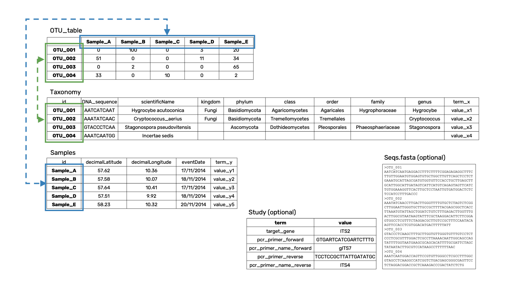

[[preparation_structure]]
== Dataset preparation and structure

This section contains detailed information and best practices on how to prepare and structure datasets for uploading and processing.

TIP: You may want to read sections of the general guide – https://doi.org/10.35035/doc-vf1a-nr22[Publishing DNA-derived data through biodiversity data platforms] – for background information. Specifically: https://docs.gbif.org/publishing-dna-derived-data/en/#rationale[Rationale], https://docs.gbif.org/publishing-dna-derived-data/en/#environmental-dna-as-a-source-for-dna-derived-occurrence-data[Environmental DNA as a source...], https://docs.gbif.org/publishing-dna-derived-data/en/#dna-metabarcoding-sequence-derived-data[DNA metabarcodin data], https://docs.gbif.org/publishing-dna-derived-data/en/#introduction-to-biodiversity-publishing[Introduction to publishing], https://docs.gbif.org/publishing-dna-derived-data/en/#taxonomy-of-sequences[Taxonomy of sequences], https://docs.gbif.org/publishing-dna-derived-data/en/#taxonomy-of-sequences[Mapping metabarcoding data]

IMPORTANT: The general guide – https://doi.org/10.35035/doc-vf1a-nr22[Publishing DNA-derived data through biodiversity data platforms] – contains a lot of advice and guidance on data preparation and mapping (incl required/recommended fields). the MDT will handle most of these things automatically/interactively. If your data fits one of the provided OTU table templates in this MDT user guide, the processing steps should be straightforward and easy to follow

=== Basic checks and preparations

Ensure the following applies to your dataset:

* The data is DNA metabarcoding (i.e. amplified and sequenced marker genes), not something else (e.g. shotgun metagenomics, qPCR).
* You have processed data as an OTU table with associated OTU/ASV sequences and sample metadata.
* You have permission to share the data on GBIF.
* Essential metadata (e.g. location, date) is available.
* The OTU table includes the number of sequence reads per OTU/sample.
* Non-samples (e.g. negative/positive controls, PCR blanks) are identified and can be excluded, e.g. by removing them from the *Samples* table.
* OTU/ASV sequences are available.
* Contaminant or non-trustworthy OTUs are identified and can be excluded, e.g. by removing them from the *Taxonomy* table.

*Dataset descriptions, people and other metadata*

Before uploading and processing your dataset in the MDT, it's recommended to prepare a dataset description and gather information about the contributors to be associated with the data. This information will be entered during the 5th processing step (*Add Metadata*) in the MDT.

You need to prepare #I need input here#:

* A dataset title. Choose something descriptive. Examples:
** COI data from: Environmental DNA metabarcoding differentiates between micro-habitats within the rocky intertidal.
** eDNA from water column to characterise fish and invertebrate communities from 30 sites in the Belgian Part of the North Sea -12S
* A dataset description:
** What is the dataset about?
** For what purpose was it produced/collected?
** How was the samples collected, and how was the data produced?
** See e.g. this https://www.gbif.org/dataset/9358fbd7-cfd0-4eab-99fa-0934396a0529[dataset], where these things have been described in different sections:Description, Purpose, Methodology (with sub-headers)
* Scientific papers related to the dataset.
* Persons that should be associated with the dataset, and thus credited when data is reused. This could be people associated with the research paper, the laboratory personnel, persons preparing the dataset for GBIF publication, helping out with the metadata desciption, etc. gather their:
** Name
** Affiliation
** Address
** Email
** ORCID
* For each person there is the possibility to select a role. If in doubt use the creator role.
* All persons added will be listed as authors in the suggested dataset citation.
* Be sure to designate one of the persons as the contact person. This is the person that will be contacted if e.g. users find issues in the data.

[[fit_data]]
=== The OTU table

The MDT accepts analysed DNA metabarcoding data in the OTU table format, commonly used in eDNA metabarcoding. It reshapes this data into a Darwin Core Archive (DwC-A) for publishing to GBIF.

An OTU table is a specialized species/site matrix used in biodiversity and community ecology science, summarizing the presence and abundance of organisms across samples. Each row represents an OTU, and each column represents a sample, with the cell values indicating the number of sequence read counts.

Note: The MDT expects OTU tables to only contain read counts, with taxonomic and sample metadata provided separately in linked tables.

.An example OTU_table with OTUs linked to Taxonomy and Samples tables. *OTU_table* sequence read counts of each OTU per sample; *Taxonomy* DNA sequences and taxonomy; *Samples* Sample metadata; *Study (optional)* Metadata applying to the all samples and OTUs; *Seqs.fasta (optional)* OTU sequences in fasta format.

=== Fitting the data into a template

Tables/files are uploaded as separate text files OR as sepate sheets in _one_ Excel Workbook (except the the Seqs.fasta).

Select the <<templates, template>> most suitable for your data.

Fit the data to the template following the guidance below. Provide as many of the <<req_recom, required and recommended fields>> as possible.

TIP: The order (sorting) of rows and columns in the tables is not important. 

*OTU_table*

* Separate text file (named OTU_table.csv or OTU_table.tsv) OR as sheet (named OTU_table) in Excel Workbook.
* Format your *OTU_table* with samples as columns and OTUs as rows.
* Remove non-sample/OTU rows and columns (e.g., totals).
* Move sample or taxonomy (meta-)data to separate tables.
* Use 0 for OTUs with zero reads (not "NA" or "-").
* Ensure Sample IDs (column headers) and OTU IDs (row names) are unique and clean. (NB: Sample IDs will be used as term:dwc[eventID]).
* Leave the top-left cell of the table empty.

[[tax_form]]
*Taxonomy*

* Separate text file (named Taxonomy.csv or Taxonomy.tsv) OR as sheet (named Taxonomy) in Excel Workbook.
* Format OTU sequence and taxonomy data with OTUs as rows and fields as columns.
* Label the first column as `id` to match OTU IDs in the *OTU_table*.
* Include these fields:
** term:dwc[DNA_sequence] for each OTU, unless provided in a fasta file.
** Taxonomic information (assignment of each OTU) – progressively detailed. (NB: none is required, at least term:dwc[scientificName is highly recommended):
*** Use term:dwc[scientificName] for the most specific taxonomic identity. GBIF accepts BOLD BINs/UNITE SH codes here also.
*** Add term:dwc[kingdom] (from the GBIF taxonomic backbone) to guide the interpretation of the term:dwc[scientificName]
*** Add other taxonomic ranks (term:dwc[phylum], term:dwc[class], term:dwc[order], term:dwc[family], term:dwc[genus], term:dwc[specificEpithet]) if they are compativle with the GBIF taxonomy.
*** Add term:dwc[taxonRank] to indicate the actual taxonomic rank of each term:dwc[scientificName]

NOTE: Metadata like sequencing platform and primers can go in the *Study* table if identical across all OTUs. Mixed datasets (e.g., different primer sets used for the same set of samples) should be published separately.

TIP: Exclude unwanted OTUs by removing them from the *Taxonomy* table only.

*Samples*

* Separate text file (named Samples.csv or Samples.tsv) OR as sheet (named Samples) in Excel Workbook.
* Format sample metadata with Sample IDs as rows and fields as columns.
* Label the first column `id` to match Sample IDs in the *OTU_table* (used as term:dwc[eventID]).
* Include specific metadata (e.g., location, date, links to raw data).
* Include as many <<req_recom, required and recommended fields>> as possible, and consider additional https://dwc.tdwg.org/list/#dwc_Occurrence[Darwin Core] and http://rs.gbif.org/terms/1.0/DNADerivedData[DNA derived data extension] fields if needed.

TIP: Exclude control samples, etc. by removing them from the *Samples* table only.

*Study* (optional)

Recommended for metadata applying to the whole dataset (e.g., primer info, platform). Reduces redundancy and minimizes errors.

* Two columns: _term_ and _value_. Use terms from https://dwc.tdwg.org/list/#dwc_Occurrence[Darwin Core] and http://rs.gbif.org/terms/1.0/DNADerivedData[DNA derived data extension].
* Include as many required/recommended fields as possible.
* Ensure correct term spelling, as manual mapping is not allowed.

.The optional *Study* table. A minimalistic with 5 term-value pairs describing metadata relevant for all samples in the dataset.
image::img/study_table.png[pdfwidth=40%,scaledwidth=40%]

*Seqs.fasta* (optional)

The MDT accepts a https://en.wikipedia.org/wiki/FASTA_format[fasta file^] for sequences.

* Always a separate text file named *Seqs.fasta* (to be included if sequences are not in the *Taxonomy* table)
* Header Line: Begins with ">", followed by an OTU ID matching the *OTU_table*.
* Sequence Data: Continuous or split lines of nucleotide bases (A, C, T, G).
* Separate entries by ">" symbols.

.The optional *Seqs.fasta* file. A text file with the DNA sequences associated with the OTUs in fasta format.
image::img/fasta_file.png[pdfwidth=40%,scaledwidth=40%]

[[req_recom]]
=== Required and recommended fields

 All fields from https://dwc.tdwg.org/list/#dwc_Occurrence[Darwin Core Occurrence] and the http://rs.gbif.org/terms/1.0/DNADerivedData[DNA derived data extension] can be used to describe the dataset. This sections details the usage of required and recommended fields.

==== Quick reference on required and recommended fields

*Fields to be provided by user*

* *Required*: term:mixs[DNA_sequence], term:dwc[scientificName], term:dwc[eventDate], term:dwc[eventID] (Sample ID is used by default, automatically).
* *Highly recommended*: term:dwc[materialSampleID], term:dwc[recordedBy], term:dwc[decimalLatitude], term:dwc[decimalLongitude], term:mixs[target_gene], term:mixs[target_subfragment], term:mixs[pcr_primer_forward], term:mixs[pcr_primer_reverse], term:mixs[pcr_primer_name_forward], term:mixs[pcr_primer_name_reverse],term:mixs[pcr_primer_reference], term:mixs[seq_meth], term:mixs[otu_class_appr], term:mixs[otu_seq_comp_appr], term:mixs[otu_db], term:dwc[kingdom].
* *Recommended*: term:mixs[env_broad_scale], term:mixs[env_local_scale], term:mixs[env_medium], term:dwc[associatedSequences], term:mixs[lib_layout], term:mixs[sop], term:dwc[samplingProtocol], term:dwc[identificationRemarks], term:dwc[identificationReferences], term:dwc[phylum], term:dwc[class], term:dwc[order], term:dwc[family], term:dwc[genus].

*Fields automatically handled/filled by the MDT*

* Some required or recommended fields are *automatically handled* by the MDT and do not require any input from the user: term:dwc[basisOfRecord], term:dwc[occurrenceID], term:dwc[organismQuantity], term:dwc[organismQuantityType], term:dwc[sampleSizeValue], term:dwc[sampleSizeUnit], term:dwc[taxonID], (term:dwc[eventID] – the MDT uses the proveded sample IDs by default).

==== Detailed reference on required and recommended fields

Tables are modified/specialized version of those in https://doi.org/10.35035/doc-vf1a-nr22[Publishing DNA-derived data through biodiversity data platforms] from the section https://docs.gbif.org/publishing-dna-derived-data/en/#mapping-metabarcoding-edna-and-barcoding-data[Mapping metabarcoding (eDNA) and barcoding data]. 

When using the MDT, it's not essential to distinguish between Darwin Core Occurrence or DNA-derived data terms. What matters is placing fields and their values in the correct table of the OTU template. The 'Placement' column of the tables below guides where to input each field and indicates which required or recommended fields are automatically handled by the MDT.

[[table-01]]
.Recommended fields for http://rs.gbif.org/core/dwc_occurrence_2020-04-15.xml[Occurrence core] for Metabarcoding data. This table is a modified version of table 2 in the https://docs.gbif.org/publishing-dna-derived-data/en/#mapping-metabarcoding-edna-and-barcoding-data[dna-publishing guide] specifically for using the MDT.
[cols="1,1,4,1,1",options="header"]
|===
| Field name
| Examples / explanation
| Description
| Required
| Placement

| term:dwc[basisOfRecord]
| _This field is is automatically set as "MATERIAL_SAMPLE" by the MDT_
| The specific nature of the data record - a subtype of the http://rs.gbif.org/vocabulary/dwc/basis_of_record.xml[dcterms:type].
| Required
| _Automated in MDT_

| term:dwc[occurrenceID]
| _This field is automatilly contructed by the MDT as "eventID:OTU_id"_
| A unique identifier for the occurrence, allowing the same occurrence to be recognized across dataset versions as well as through data downloads and use.
| Required
| _Automated in MDT_

| term:dwc[eventID]
| _This field automatically uses Sample ID_
| An identifier for the set of information associated with an Event (something that occurs at a place and time).
| Highly recommended
| _Automated in MDT_

| term:dwc[eventDate]
| 2020-01-05
| Date when the event was recorded. Recommended best practice is to use a date that conforms to ISO 8601-1:2019. For more information, check https://dwc.tdwg.org/terms/#dwc:eventDate
| Required
| *Samples* (or *Study*)

| term:dwc[recordedBy]
| "Oliver P. Pearson \| Anita K. Pearson"
| A list (concatenated and separated) of names of people, groups, or organizations responsible for recording the original Occurrence. The recommended best practice is to separate the values with a vertical bar (' \| '). Including information about the observer improves the scientific reproducibility (https://doi.org/10.1093/database/baaa072[Groom et al. 2020^]).
| Highly recommended
| *Samples* or *Study*

| term:dwc[organismQuantity]
| _This field is automatically set, reflecting the read count in the cell of the OTU table_
| Number of reads of this occurrence (OTU/ASV in sample).
| Highly recommended
| _Automated in MDT_

| term:dwc[organismQuantityType]
| _This field is automatically set as "DNA sequence reads"_
| Should always be “DNA sequence reads”
| Highly recommended
| _Automated in MDT_

| term:dwc[sampleSizeValue]
| _This field is automatically calculated as the total sequeunce read sum of the sample_
| Total number of reads in the sample. This is important since it allows calculating the relative abundance of each OTU or ASV within the sample.
| Highly recommended
| _Automated in MDT_

| term:dwc[sampleSizeUnit]
| DNA sequence reads
| _This field is automatically set as “DNA sequence reads”_
| Highly recommended
| _Automated in MDT_

| term:dwc[materialSampleID]
| https://www.ncbi.nlm.nih.gov/biosample/15224856 +
 +
https://www.ebi.ac.uk/ena/browser/view/SAMEA3724543 +
 +
urn:uuid:a964805b-33c2-439a-beaa-6379ebbfcd03
| An identifier for the MaterialSample (as opposed to a particular digital record of the material sample). Use the biosample ID if one was obtained from a nucleotide archive. In the absence of a persistent global unique identifier, construct one from a combination of identifiers in the record that will most closely make the materialSampleID globally unique.
| Highly recommended
| *Samples*

| term:dwc[samplingProtocol]
| UV light trap
| The name of, reference to, or description of the method or protocol used during a sampling Event. https://dwc.tdwg.org/terms/#dwc:samplingProtocol
| Recommended
| *Study* (or *Samples*)

| term:dwc[associatedSequences]
| https://www.ebi.ac.uk/ena/browser/view/ERR1202046
| A list (concatenated and separated) of identifiers (publication, global unique identifier, URI). For most cases it would be linking to archived raw metabarcoding read files in a public repository.
| Recommended
| *Samples*

| term:dwc[identificationRemarks]
| RDP annotation confidence (at lowest specified taxon): 0.96, against reference database: GTDB
| Specification of taxonomic identification process, ideally including data on applied algorithm and reference database, as well as on level of confidence in the resulting identification.
| Recommended
| *Study* (or *Taxonomy*)

| term:dwc[identificationReferences]
| https://www.ebi.ac.uk/metagenomics/pipelines/4.1 + 
 +
https://github.com/terrimporter/CO1Classifier
| A list (concatenated and separated) of references (publication, global unique identifier, URI) used in the Identification. Recommended best practice is to separate the values in a list with space vertical bar space ( \| ).
| Recommended
| *Study* (or *Taxonomy*)

| term:dwc[decimalLatitude]
| 60.545207
| The geographic latitude (in decimal degrees, using the spatial reference system given in geodeticDatum) of the geographic centre of a Location. Positive values are north of the Equator, negative values are south of it. Legal values lie between -90 and 90, inclusive.
| Highly recommended
| *Samples* (or *Study*)

| term:dwc[decimalLongitude]
| 24.174556
| The geographic longitude (in decimal degrees, using the spatial reference system given in geodeticDatum) of the geographic centre of a Location. Positive values are east of the Greenwich Meridian, negative values are west of it. Legal values lie between -180 and 180, inclusive.
| Highly recommended
| *Samples* (or *Study*)

// The [.break-all]#ASV:…# is to allow the identifier to be broken at any character, rather than stretching the text cell.
| term:dwc[taxonID]
| _This field is automatically calculated as the MD5 hash of the sequence – e.g. [.break-all]#ASV:7bdb57487bee022ba30c03c3e7ca50e1#_
| For eDNA data, it is recommended to use an MD5 hash of the sequence and prepend it with “ASV:”. See also <<taxonomy-of-sequences>>.
| Highly recommended
| _Automated in MDT_

| term:dwc[scientificName]
| _Gadus morhua_ L. 1758, BOLD:ACF1143
| Scientific name of the closest known taxon (species or higher) or an OTU identifier from BOLD (BIN) or UNITE (SH)
| Required (filled with "Incertae sedis" if left blank)
| *Taxonomy*

| term:dwc[kingdom]
| Animalia
| Higher taxonomy
| Highly recommended
| *Taxonomy*

| term:dwc[phylum]
| Chordata
| Higher taxonomy
| Recommended
| *Taxonomy*

| term:dwc[class]
| Actinopterygii
| Higher taxonomy
| Recommended
| *Taxonomy*

| term:dwc[order]
| Gadiformes
| Higher taxonomy
| Recommended
| *Taxonomy*

| term:dwc[family]
| Gadidae
| Higher taxonomy
| Recommended
| *Taxonomy*

| term:dwc[genus]
| _Gadus_
| Higher taxonomy
| Recommended
| *Taxonomy*

|===

<<<

[[table-02]]
.Recommended fields from the DNA derived data extension (a selection) for metabarcoding data. This table is a modified version of table 3 in the https://docs.gbif.org/publishing-dna-derived-data/en/#mapping-metabarcoding-edna-and-barcoding-data[dna-publishing guide] specifically for using the MDT.
[cols="1,1,4,1,1",options="header"]
|===
| Field name
| Examples
| Description
| Required
| Placement

// The [.break-all]#TCTA…# is to allow the sequence to be broken at any character, rather than stretching the text cell.
| term:mixs[DNA_sequence]
| [.break-all]#TCTATCCTCAATTATAGGTCATAATTCACCATCAGTAGATTTAGGAATTTTCTCTATTCATATTGCAGGTGTATCATCAATTATAGGATCAATTAATTTTATTGTAACAATTTTAAATATACATACAAAAACTCATTCATTAAACTTTTTACCATTATTTTCATGATCAGTTCTAGTTACAGCAATTCTCCTTTTATTATCATTA#
| The DNA sequence (e.g. ASV or OTU centroid, consensus). Taxonomic interpretation of the sequence depends on the technology and reference library available at the time of publication. Hence, the most objective taxonomic handle is the sequence which can be reinterpreted in the future.
| Required (Highly recommended)
| *Taxonomy* or in a separate fasta file (*Seqs.fasta*)

| term:mixs[sop]
| https://www.protocols.io/view/emp-its-illumina-amplicon-protocol-pa7dihn
| Standard operating procedures used in assembly and/or annotation of genomes, metagenomes or environmental sequences. +
 +
A reference to a well documented protocol, e.g. using https://protocols.io[protocols.io]
| Recommended
| *Study*

| term:mixs[target_gene]
| 16S rRNA, 18S rRNA, ITS
| Targeted gene or marker name for marker-based studies
| Highly recommended
| *Study*

| term:mixs[target_subfragment]
| V6, V9, ITS2
| Name of subfragment of a gene or marker important to e.g. identify special regions on marker genes like the hypervariable V6 region of the 16S rRNA gene
| Highly recommended
| *Study*

| term:mixs[pcr_primer_forward]
| GGACTACHVGGGTWTCTAAT
| Forward PCR primer that was used to amplify the sequence of the targeted gene, locus or subfragment.
| Highly recommended
| *Study*

| term:mixs[pcr_primer_reverse]
| GGACTACHVGGGTWTCTAAT
| Reverse PCR primer that was used to amplify the sequence of the targeted gene, locus or subfragment.
| Highly recommended
| *Study*

| term:mixs[pcr_primer_name_forward]
| jgLCO1490
| Name of the forward PCR primer
| Highly recommended
| *Study*

| term:mixs[pcr_primer_name_reverse]
| jgHCO2198
| Name of the reverse PCR primer
| Highly recommended
| *Study*

| term:mixs[pcr_primer_reference]
| https://doi.org/10.1186/1742-9994-10-34
| Reference for the primers
| Highly recommended
| *Study*

| term:mixs[env_broad_scale]
| forest biome [ENVO:01000174]
| *Equivalent to env_biome in MIxS v4* +
In this field, report which major environmental system your sample or specimen came from. The systems identified should have a coarse spatial grain, to provide the general environmental context of where the sampling was done (e.g. were you in the desert or a rainforest?). We recommend using subclasses of ENVO’s biome class: +
http://purl.obolibrary.org/obo/ENVO_00000428
| Recommended (ENVO can be browsed and selected interactively in the MDT)
| *Samples*

| term:mixs[env_local_scale]
| litter layer [ENVO:01000338]
| *Equivalent to env_feature in MIxS v4* +
In this field, report the entity or entities which are in your sample or specimen´s local vicinity and which you believe have significant causal influences on your sample or specimen. Please use terms that are present in ENVO and which are of smaller spatial grain than your entry for env_broad_scale.
| Recommended (ENVO can be browsed and selected interactively in the MDT)
| *Samples*

| term:mixs[env_medium]
| soil[ENVO:00001998]
| *Equivalent to env_material in MIxS v4* +
In this field, report which environmental material or materials (pipe separated) immediately surrounded your sample or specimen prior to sampling, using one or more subclasses of ENVO´s environmental material class: +
http://purl.obolibrary.org/obo/ENVO_00010483
| Recommended (ENVO can be browsed and selected interactively in the MDT)
| *Samples*

| term:mixs[lib_layout]
| Paired
| *Equivalent to lib_const_meth in MIxS v4* +
Specify whether to expect single, paired, or other configuration of reads
| Recommended
| *Samples*

| term:mixs[seq_meth]
| Illumina HiSeq 1500
| Sequencing method/platform used
| Highly recommended
| *Study*

| term:mixs[otu_class_appr]
| "dada2; 1.14.0; ASV"
| Approach/algorithm and clustering level (if relevant) when defining OTUs or ASVs
| Highly recommended
| *Study*

| term:mixs[otu_seq_comp_appr]
| "blastn;2.6.0+;e-value cutoff: 0.001"
| Tool and thresholds used to assign "species-level" names to OTUs or ASVs
| Highly recommended
| *Study*

| term:mixs[otu_db]
| "Genbank nr;221", "UNITE;8.2"
| Reference database (i.e. sequences not generated as part of the current study) used to assigning taxonomy to OTUs or ASVs
| Highly recommended
| *Study*
|===

<<<
