[[detailed_guidance]]
== Detailed User Guide

*Users with prepared dataset*: skip to: <<detailed_select_mdt>>.

*Users without a dataset*: use the provided example dataset (see below). 

****
*The example dataset* +

A real metabarcoding dataset of surface seawater metazoan communities – slightly modified.

. Download link:../example_data/example_data2.current.en.xlsx[example_dataset_2].
. Explore the structure of the example dataset.
** The *OTU_table*. Column headers (_CO1_A1.1006.a.S1.L001, etc._) are IDs of the 159(160) samples. Row names (_merged_CO1_1, etc._) are IDs of the 24.744 OTUs.
** The *Taxonomy* table contains OTU IDs correspoding to those (rownames) in the *OTU_table*, the sequence, and taxonomic information.
** The *Samples* table contains IDs correspoding to those (column names) in the *OTU_table*, and sample metadata: spatiotemporal data, date, etc. NB: Some fields are already using DwC terms; others are not yet standardized and will need manual mapping.
** The *Study* table with information/data that is the same across all samples (and/or OTUs) in the whole dataset. All fields (the term column) are already using exact Darwin Core terms as needed for this table.

NOTE: The 160th column of the OTU table corresponds to a negative control sample (NEG), and the corresponding detections should not be included as occurrences in the GBIF dataet. However, the MDT will automatically remove samples that are not present in _both_ the *OTU_table* and *Samples* tables. Here, the negative control has already been removed from the *Samples* table.
****

[[detailed_select_mdt]]
=== Select an MDT Installation

[discrete]
=== A. Still learning or testing?
Use the https://mdt.gbif-test.org/[GBIF MDT Sandbox (Demo Installation)]!

[discrete]
=== B. Got a real dataset?
Use the most relevant MDT installation for your dataset: <<mdt_installations>>.

. Log into the selected MDT with your https://www.gbif.org/user/profile[*GBIF account*]

From the landing page users can access datasets, start new uploads, etc. (see more here: <<detailed_landing>>).

=== Upload data (step 1)

. Press *New Dataset* in the upper part of the page to go to the first step (Upload data).
. Drag and drop the dataset to the upload area, or click and select the file.
. Give the dataset a nickname (e.g. "my_advanced_test").
. Press *Start Upload*.
+
A green icon will indicate if a valid file format is detected.

****
*The example dataset* + 

* A green XLSX icon will indicate that this valid file format is detected.
* A warning will inform that one of the columns in the OTU_table does not have a corresponding row in the Sample table. We knew that, and it is OK, as we wanted that sample to be removed in the final data (see above).
****

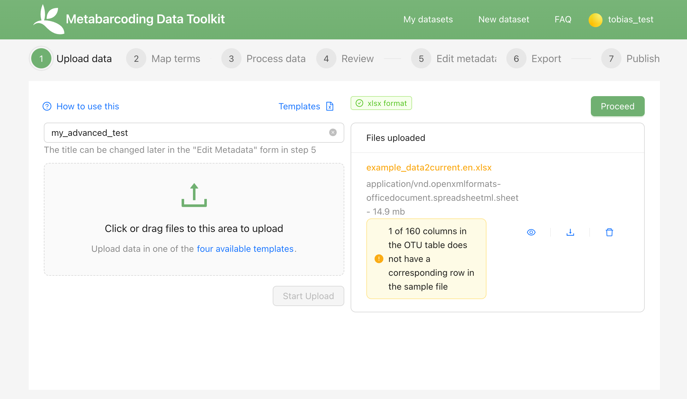

[start=4]
. Open the data viewer by clicking on the eye icon next to the uploaded dataset.
. View and verify the structure and content of the tables - e.g. corresponding to the four sheets in the uploaded Excel Workbook for the example dataset.
. Close the viewer by pressing *Back*.
. Press *Proceed*.

=== Map terms (step 2)

At this step it is specified how each field corresponds to Darwin Core terms - i.e. mapping. It is possible to adjust the automatic mapping, to include extra fields with global values, and to add non-standardised data as so-called extended measurements or facts.

TIP: Press *how to use this form* to get a guided tour of this page.

TIP: Press *Save mapping* once in a while to make sure that you do not get logged out.

==== Automatic mapping

. Inspect the overall structure and information on the page.
.. The upper section named *Samples* maps our sample data fields to Darwin Core terms (first column), automatically identifying and mapping fields from the *Samples* table (second column) and global fields from the *Study* table (third column) with their identically named Darwin Core counterparts.
.. The second section named *Taxon* does the same for taxonomic and sequence related information, auto-mapping fields from the *Taxonomy* table to identically named Darwin Core fields.
.. The last section *Unmapped fields* lists all the fields in the uploaded data, with names the MDT do not automatically recognize. Below there is an option to put unmapped fields into so-called *Extended Measurement Or Facts*.
. Press *Save Mapping* and notice how you get a warning if some essential fields have not been mapped.

****
*The example dataset* +

._Sample section_: the MDT automatically identified and mapped 6 fields from the uploaded Samples table (second column) and approx. 20 global term/values from the Study table (third column) to identically named Darwin Core terms (first colum).
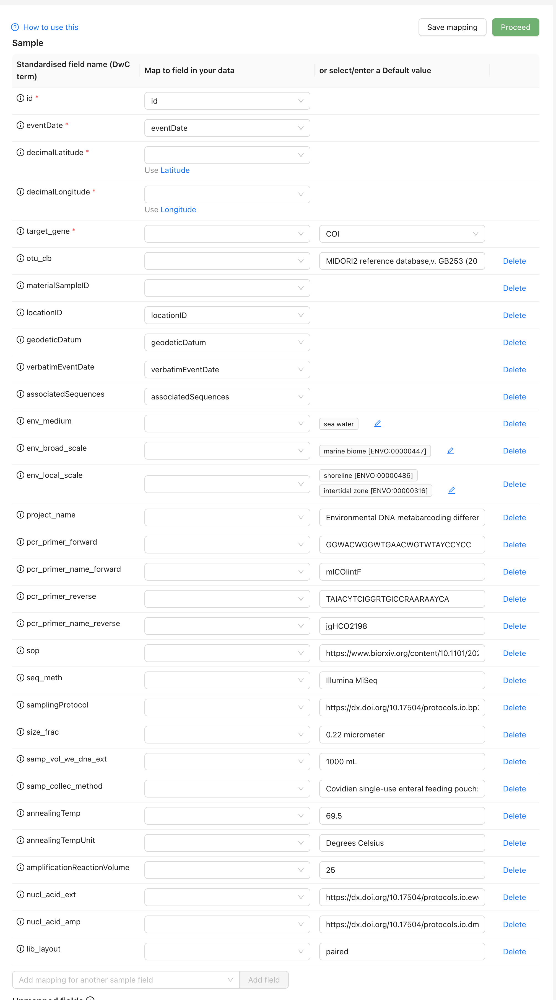

._Taxon section_: the MDT automatically identified and mapped 10 fields from the uploaded Taxonomy table.
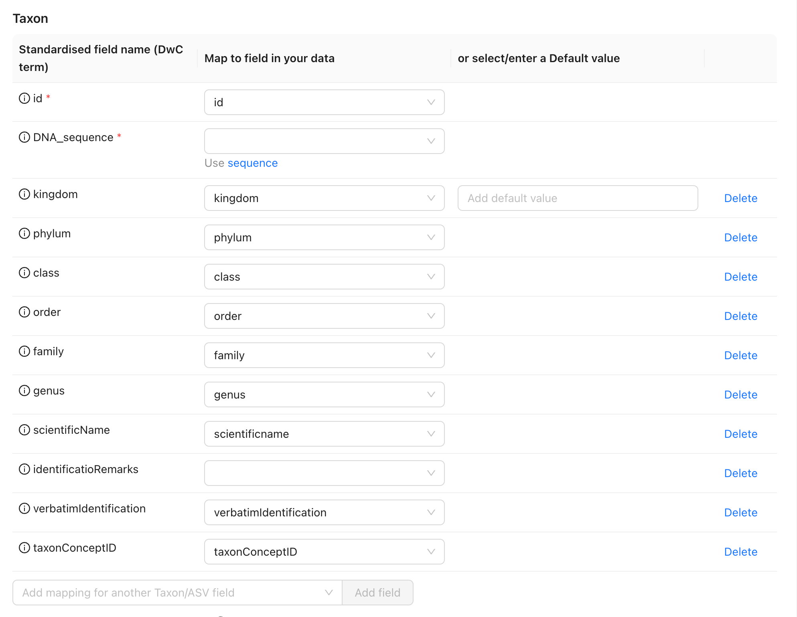

****

==== Suggested mapping

[start=3]
. Inspect potential suggested mappings and click to accept and specify them.

****
*The example dataset* +

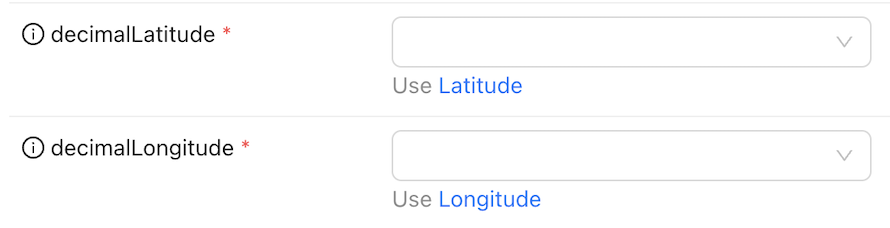

. term:dwc[decimalLatitude] and term:dwc[decimalLatitude] were not mapped automatically, but it is suggested to use _Latitude_ and _Longitude_.
. Click on _Latitude_ to specify that mapping, and the same for _Longitude_.

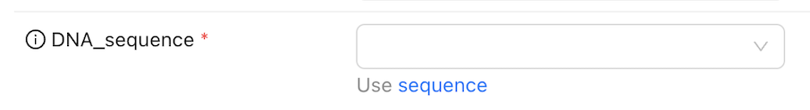

[start=3]
. term:mixs[DNA_sequence] was not mapped automatically, but the MDT suggests to use _sequence_.
. Click on _sequence_ to specify that mapping.
****

==== Manual mapping 

Under *Unmapped fields* (above the *Taxon* section) we may see fields from the uploaded data, that were not automatically identified and mapped to any Darwin Core terms.

We expect that Darwin Core may accomodate several of these un-mapped fields, and we may also want to modify and extend the uploaded data a bit.

[start=4]
. Try to accomodate as many of unmapped fields by mapping them to relevant Darwin Core terms, by *Add mapping for another sample field*. Use the search function as explained above, consult the section <<req_recom>>, or explore available fields/terms in https://dwc.tdwg.org/list/#dwc_Occurrence[Darwin Core Occurrence] and the http://rs.gbif.org/terms/1.0/DNADerivedData[DNA derived data extension].
. Also use *Add mapping for another sample field* to add DwC terms, where you can provide global values that were not provided in the *Study* table of the uploaded data. Provide the global value of an added term in the third column (Default values).

****
*The example dataset* +
_Sample_Name, temperature, salinity, Accession_biosamples, lsid, rank_ are listed under *Unmapped fields*, as these fields in the uploaded data were not automatically identified and mapped to Darwin Core terms.

. One of the unmapped fields is called _Accession_biosamples_ and contains links to  Biosample records in INSDC (SRA/ENA). We want to map that field to the recommended Darwin Core term term:dwc[materialSampleID] for that.
. Go to the last part of the *Sample* section. 
. Click on *Add mapping for another sample field* and look at the list of available terms.
.. Start typing "material" to find and select term term:dwc[materialSampleID].
.. Click *Add field*, and notice how the field is added to the list of terms.
.. Now, select the field _Accession_biosamples_ from the drop-down list to map it.
. We can also see that we forgot to provide the term:mixs[env_medium] in the format recommended using the ENVO ontology, but simply wrote "sea water". To fix that:
.. Click on the pencil to the right of "sea water". A dialogue box opens.
.. Remove "sea water" by clicking the "sea water x".
.. Search for "coastal sea"
.. Select  "coastal sea water" with OBO ID "ENVO:00002150". (NB: you can also click the link and explore the ENVO ontology online).
.. Scroll down and press "OK" to close the dialogue box.
+
NOTE: term:mixs[env_broad_scale] and term:mixs[env_local_scale] were also described with the ENVO ontology, but values were correctly was supplied in the uploaded data. Multiple values are possible: `shoreline [ENVO:00000486]` and `intertidal zone [ENVO:00000316]` for term:mixs[env_local_scale].
. As this data was also intended for publishing to OBIS, so-called lsid were provided for the taxonomic names according to the WoRMS checklist. Following the OBIS recommendations we will map that field to the term:dwc[scientificNameID].
.. Go to the *Taxon* section.
.. Click the "Add mapping for another Taxon/ASV field".
.. Search, find and select term:dwc[scientificNameID].
.. Map it to _lsid_.
. Similarly add the term term:dwc[taxonRank] and map it to _rank_.
****

==== Using Extended Measurements Or Facts

For some types of metadata there are no suitable fields in the data standards, but users may still want to include those in the final data. Such data can be accomodated in the *Extended Measurement Or Facts (eMoF)*

The section *Unmapped fields* fields that remain unmapped are listed. These can be added as extended measurements/facts.

[start=6]
. Click on any field name from the row of unmapped fields (in the *Extended Measurement Or Facts* section) and see how it is transferred to the eMoF section below as a new entry.
. Add as many of the other descriptive fields as possible
. Repeat for all fields you wish to include as *eMoF*

****
*The example dataset*

As there is no suitable field for _salinity_ in the dataset, this can be added as an extended measurement.

. Click on _salinity_ from the row of unmapped fields (in the *Extended Measurement Or Facts* section) and see how it is transferred to the section below as a new entry.
. We know that the measurement unit is _ppt_, so we add that manually.

NB: leave the fields _temperature_ and _Sample_Name_ unmapped.
****

TIP: All available terms/fields from https://dwc.tdwg.org/list/#dwc_Occurrence[Darwin Core Occurrence] and the http://rs.gbif.org/terms/1.0/DNADerivedData[DNA derived data extension] can be included in the upload files, and – if spelled correctly – no manual mapping is needed.

NOTE: Unmapped fields will be retained MDT, also in the standardized BIOM file, and will only be absent from the produced <<dwc-a>>. They can be mapped/added later by revising the mapping if needed.

Now, the mapping is complete.

[start=9]
. Press *Proceed*.

=== Process data (step 3)

The option *Assign taxonomy* uses the https://www.gbif.org/tools/sequence-id[GBIF Sequence ID tool^] to assign taxonomy to the OTUs by comparing the sequences with a reference database. *This will replace/overwrite any taxonomy provided in the uploaded data*. NB: Often it will be better to do the taxonomic assignment separately – using the GBIF tool or another preferred tool – before uploading, as it is a time consuming step!

****
*The example dataset* +
We recommend not to use *assign taxonomy* for the example dataset. It will take a long time. _If_ using it, it will be evident that the current CO1 reference database (BOLD BINs) cannot assign taxonomy to a number of the sequences in this dataset. The rest of the guide assumes that you used the taxonomy in the uploaded data for the example dataset.
****

. Press *Process data*.
+
the MDT goes through a series of steps which will be indicated as succesful with a green tick-mark, and produces standardized BIOM files, which the MDT uses as an intermediate file format.

****
*The example dataset* +
A warning will indicate that "NEG in the OTU table are not present in the SAMPLE table". We already knew that (see above).
****

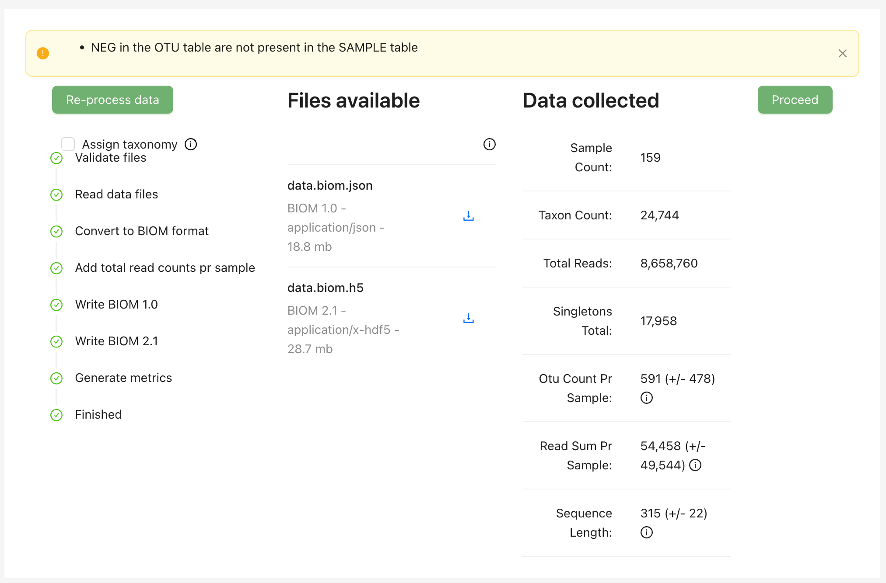

[start=2]
. Inspect the *Dataset stats* and verify that number of samples and taxa are as expected.
. Press *Proceed*

=== Review (step 4)

At this step the processed data can be explored and reviewed to verify that everything is OK, e.g. ensure that control samples are not included as samples, and that the mapping is as expected.

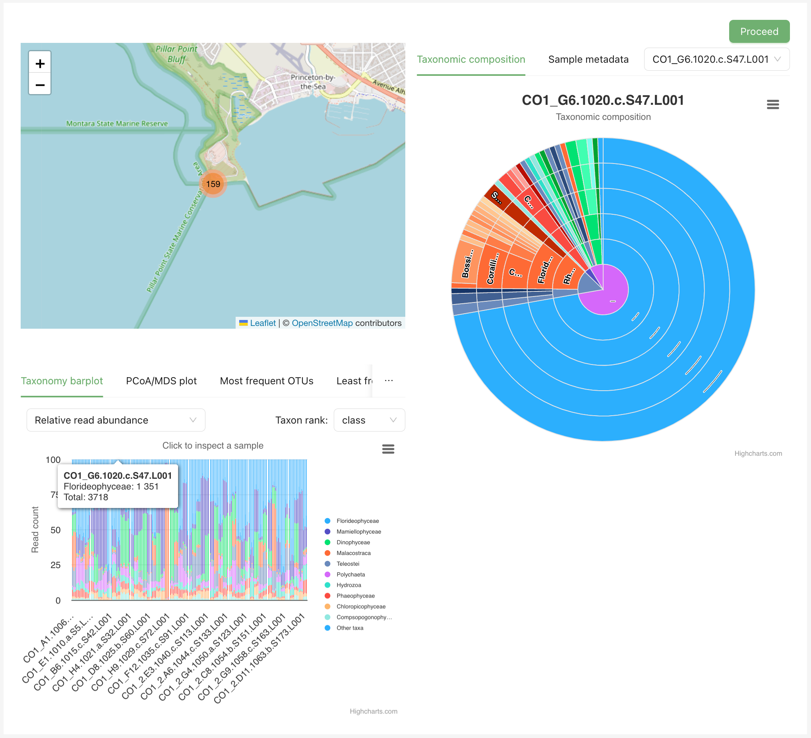

. Review the data.
** Inspect the map and verify that the samples are placed geographically where expected.
** Inspect the taxonomic bar-chart to ensure that taxonomic composition is as expected.
*** Try some of the other options for the bar-chart (e.g. Absolute read abundance).
** Inspect PCoA/MDS ordination plots (visualization of compositional differences between samples) for outliers, e.g. to see if there any control samples that should have been excluded. Try to color the ordination plot by some numerical.
** Select single samples from the map, from charts or from the dropdown, and explore their metadata and taxonomy in the panel to the right.
** Explore the "Most frequent OTUs" and "Least frequent OTUs".

****
*The example dataset*

* _Map_: Pillar Point, Half Moon Bay, California, USA.
* _Ordination plots_: Try color _salinity_ or _temperature_. _temperature_ was not mapped to any DwC term, but such unmapped fields are included in the BIOM files facilitating these visualizations.
* _"Most frequent OTUs" and "Least frequent OTUs"_: mainly "Incertae sedis", and thus not not so informative.
****

[start=2]
. Press *Proceed*.

=== Add metadata (step 5)

In this step, dataset information is added, including dataset title, description, persons and affiliations, etc.

IMPORTANT: For real-world datasets, it is highly recommended to provide comprehensive and detailed metadata. This enhances discoverability, promotes reusability, and helps data re-users better evaluate the dataset's suitability for their specific purposes.

TIP: Toggle "Show help" to get guidance text for the fields.

.*Edit metadata*. In this section you provide dataset information/metadata in defined sections (left panel): _Basic Metadata, Geographic Coverage, Taxonomic Coverage, etc._ 
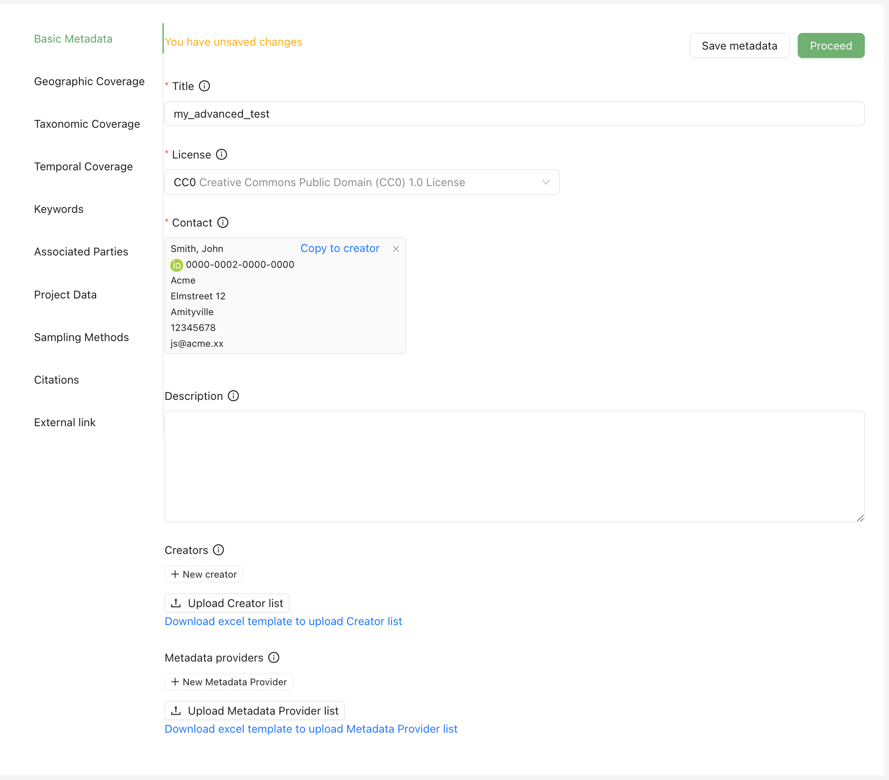

The dataset information/metadata is grouped in sections: _Basic Metadata, Geographic Coverage, Taxonomic Coverage, etc_. 

****
*The example dataset* +
Explore the metadata sections to get familiar with options. When working with a real dataset, please refer to the full guidance in this section (#not written#) and to the section on <<preparation_structure>>.

_Minimum actions to continue_: select a license and add a contact (minimum: email).
****

. Press *Proceed*.

=== Export (step 6)

At this step, the so-called <<dwc-a>> is produced. The dataset can be published directly to the GBIF [.underline]#TEST ENVIRONMENT# (UAT) in this step. This is a way for users to preview a potential real GBIF.org publication.

. Press *Create DWC archive*.
+
This process generates the <<dwc-a>> from the data, progressing through several steps, each marked with a green check if successful.
. Press *Publish to GBIF test environment (UAT)*.
+
A notification will inform you that data ingestion may take a few minutes before all samples are visible in the GBIF test environment (UAT). A link to the dataset in the test environment will appear next to the "Publish" button.
. Click on the link *Dataset at gbif-uat.org*.
. Explore the dataset in the GBIF test environment (UAT).
. Ensure that all information and data is processed and displayed appropriately as you expect.
+
IMPORTANT: Indexing/processing is not instantaneous. The dataset may e.g. have zero occurences and no map until fully indexed (usually ~15 minutes). _If_ corrections are needed, go back to the relevant step (Upload, Mapping, Metadata), perform the needed adjustments, go through all the following steps, do a new export and test publication, until the dataset is as expected.

.Pressing *Dataset at gbif-uat.org* opens the dataset (here the example dataset) in the GBIF test environment (UAT) where users can _preview_ a potential real publication, and verify that the processed dataset contains all the wanted information for real publication. NB: The dataset is not completely indexed immediately and the dataset may e.g. have 0 occurences and no map compared to this figure, until fully indexed. Notice how the hatched/shaded header and the red "TEST" label indicate that it is a test environment. Explore the dataset and notice how the uploaded data and dataset information/description is presented on the website.
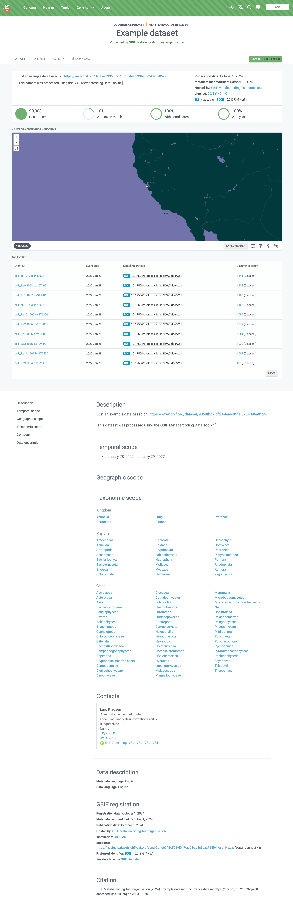

[start=6]
. Go back to the MDT.
. Press on *Publish* (directly in the header with the 7 steps).

[[publishing]]
=== Publish (step 7)

In this step it is possible to do the necessary steps for formally publishing the processed dataset to GBIF.

IMPORTANT: Users still learning/testing with example datasets should not actively use any options from this step.

MDTs can either be in *publishing mode* or *conversion-only mode*. Go to the relevant section depending on which MDT is being used:

.MDTs in <<pub_pub, *publishing mode*>>.
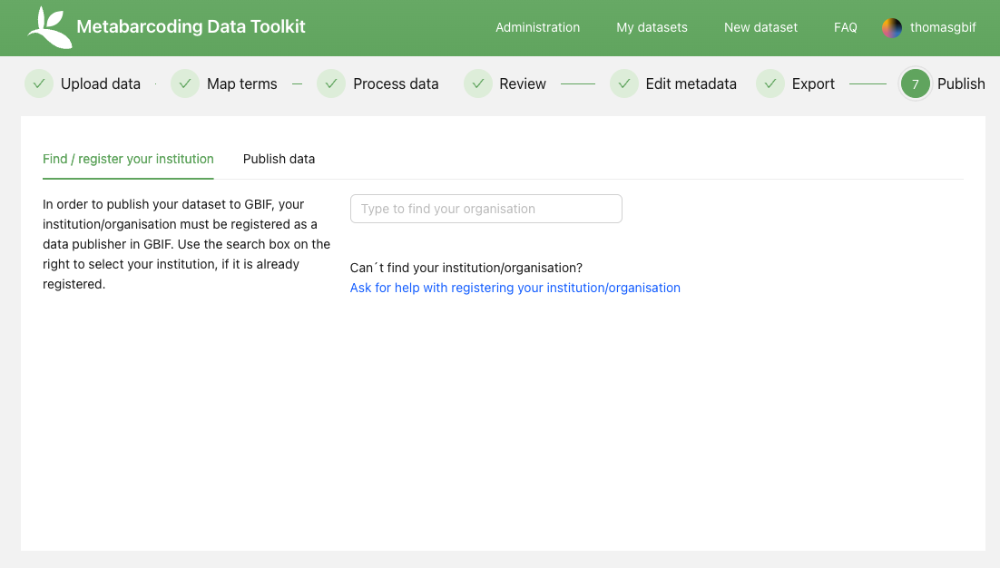

.MDTs in <<pub_con, *conversion-only mode*>>
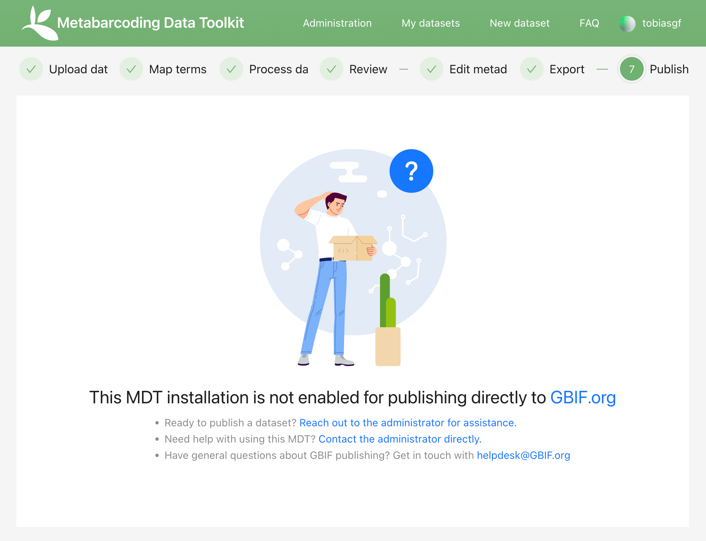

[[pub_pub]]
==== MDT in publishing mode

MDTs in publishing mode can publish directly to GBIF.

When publishing their *first dataset*, users will not yet have been associated with a publishing organization. In order to publish a dataset to GBIF, the user's institution/organisation must be registered as a data publisher in GBIF.

.To publish the first dataset on GBIF, a user's institution must be registered as a data publisher, and the user must be associated with the institution in the MDT.
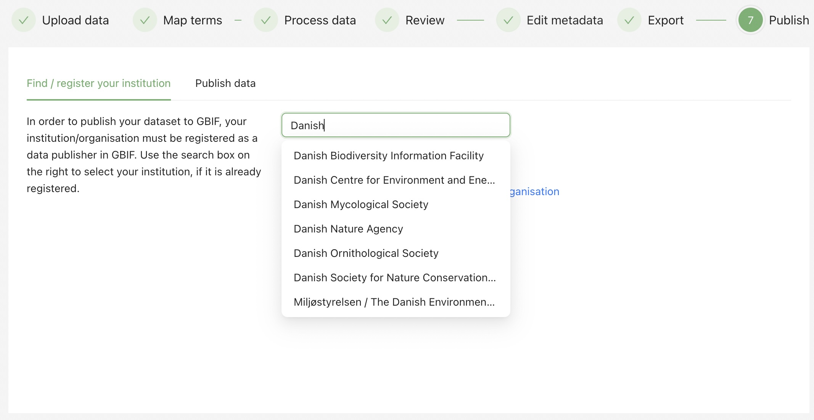

*Find/register your institution* using the search box to search for your institution.

* If your institution is already registered:
** Select it, and click on "*Ask for access to publish under this institution/organisation*". This will start a preformulated email to the administrator of the MDT, asking to associate you with the institutuion in the MDT.
** Send the mail, and allow some time for the MDT administrator to get back you you.
* If you can´t find your institution/organisation:
** Click on "*Ask for help with registering your institution/organisation*". This will start a preformulated email to the administrator of the MDT, asking for help with the steps needed in order to get your institution recognized as a GBIF data publisher and to associate you so your dataset can be published.
** Add the relevant information about your institution in the mail:
*** INSTITUTION NAME
*** INSTITUTION ADDRESS
*** CONTACT EMAIL
** Send the mail, and allow some time for the MDT administrator to get back you you

.If your institution is already registered, select it and request access to publish. If not, ask for help with registering.
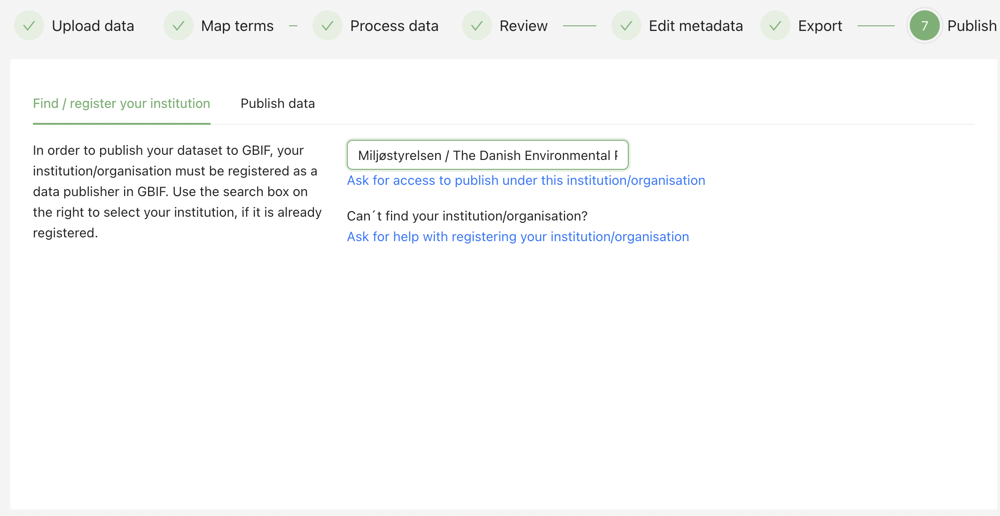

When associated with a publishing organization in the MDT, the user can publish datasets to GBIF.org:

. Select the correct publishing institution if associated with more than one.
. Confirm in the checkbox that you have read and understood the data sharing agreement.
. If relevant (users will usually know), select the Network that the dataset should be associated with. NB: selecting "OBIS" will notify OBIS that the dataset is available so they can index it. (#is that how this works?#)
. Press *Publish to gbif.org*
. That's it.

.Users that have been associated with one or more publishing organization by the MDT administrator, can publish datasets to GBIF. Confirm the data sharing agreements, and select a Network if relevant, and publish.
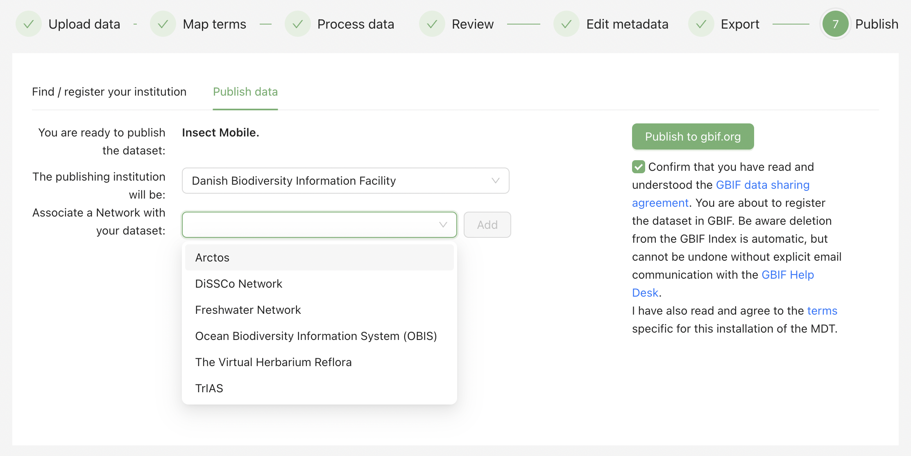

[[pub_con]]
==== MDT in conversion-only mode

When using a hosted MDT in conversion-only mode or the https://mdt.gbif.org/[GBIF Conversion MDT], the user needs to contact the administrator of the MDT by using the link "*Ready to publish a dataset? Reach out to the administrator for assistance*".

.Users of MDT installations in conversion-only should use the link "*Ready to publish a dataset? Reach out to the administrator for assistance*". This will start a preformulated email to the administrator of the MDT, requesting help.

[[detailed_landing]]
=== Landing page

. Log in with https://www.gbif.org/user/profile[*GBIF account*]

The landing page (home) is where users access their datasets, start new uploads, etc.

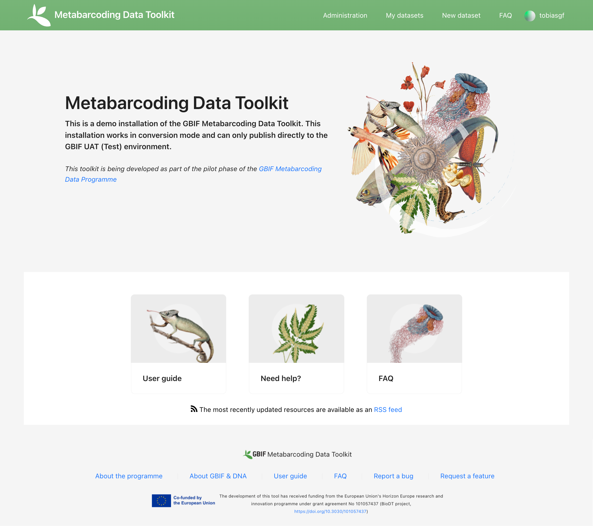

The Menu Bar contains the following items  

* <<admin,_Administration_>> (only visible to MDT Administrators)
* My datasets
* New dataset: start new data upload
* Login / User area (user name): links to: logout, My datasets

*My datasets*

In this area users can access the datasets they have uploaded to the MDT.

* Datasets can be opened (eye icon) and the _Browse_ tab allows to visualize the data similar to the review step, _Metadata_ allows inspection of basic dataset information/metadata, _Files available_ gives access to download a standardized BIOM file and a <<dwc-a>> the dataset (if these have been produced).
* Datasets can be edited. By clicking the pen icon, the dataset is opened at processing step 1 (Upload data). This allows users to initiate editing of the dataset at any of the processing steps.
* Datasets can be deleted (trash icon).
+
IMPORTANT: Do not delete or start editing a dataset that is already published on GBIF.org unless you are certain that this is needed.

.*My datasets* gives users access to view, edit/update and download previously processed datasets.
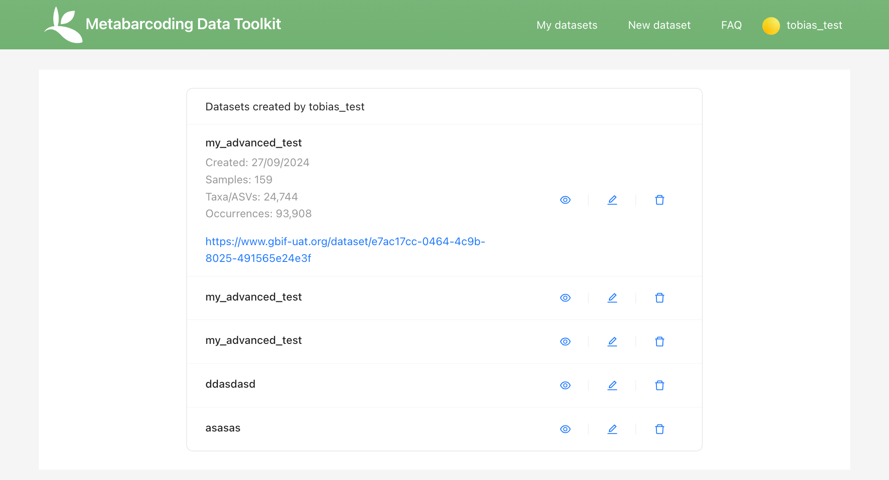

*Help, feedback and other resources*

* The *Neep help?* (fern leaf): Opens an email to contact the Administrator of the MDT installation.
* The *RSS feed*: Lists the most recently updated resources (datasets) available as an RSS feed. This can be used to monitor incoming datasets to the MDT installation.
* The *Report a bug* and *Request a feature* : Opens a GitHub issue where users can report bugs or request features to be developed.
<<<