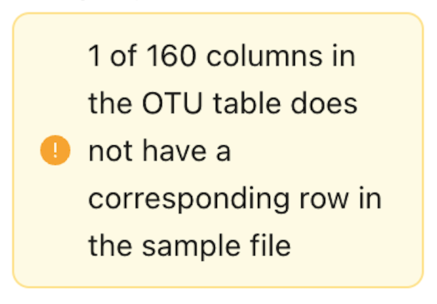
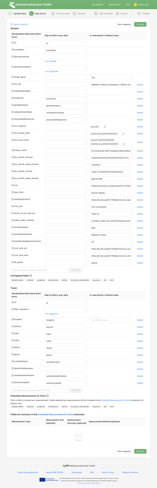

[[detailed_guidance]]
== Detailed user guide

This section provides a section wise guide to using the MDT including a step wise gudie to processing a dataset.
The guide details the processing of an example dataset, but you can also use it to process your another dataset prepared according to instructions in the section <<preparation_structure>>d.

=== Advanced example dataset

If you have your own data skip this.

If you have not yet prepared your own dataset, you can use this example dataset – a real metabarcoding dataset of surface seawater metazoan communities, that has been modified to better illustrate some features of the MDT. 

NOTE: The dataset was formatted for publishing to OBIS, and thus OTUs (sequences) identified to organisms not on the WoRMS checklist are provided with unspecified taxonomy (i.e. "Incertae sedis"). Read a more detailed description of the dataset <<example2, here>>. You can also explore the dataset in the MDT https://mdt.gbif-uat.org/dataset/3d4e6748-df68-4047-ab04-ac3c3baa7840/review[here].

. Download link:../example_data/example_data2.current.en.xlsx[example_dataset_2].
. Explore the structure of the example data.
** The *OTU_table*. Column headers (_CO1_A1.1006.a.S1.L001, etc._) are IDs of the 159(160) samples. Row names (_merged_CO1_1, etc._) are IDs of the 24.744 OTUs. Cells contain sequence read counts.
** The *Taxonomy* table contains IDs correspoding to those (rownames) in the *OTU_table*, the sequence, and taxonomic information. Notice that many OTUs have not been possible to identify (_or_ were identified to a species not on the WoRMS Checklist) and are simply named "Incertae sedis" (uncertain placement). 
** The *Samples* table contains IDs correspoding to those (column names) in the *OTU_table*, and sample metadata: spatiotemporal data, date, etc. Some fields are already using DwC terms others are not yet standardized, and will need manual mapping.
** The *Study* table with sample or study level information that is the same for the whole dataset. All fields (the term column) are already using Darwin Core terms as needed for this table.

NOTE: The 160th column of the OTU table corresponds to a negative control sample (NEG), which should be excluded from the final dataset. The MDT will automatically remove any samples that are not present in both the *Samples* and *OTU_table* tables. Since the negative control has already been removed from  *Samples*, it will not be included in the final dataset.

=== Landing page

IMPORTANT: This guide assumes that you are using the GBIF  https://edna-tool.gbif-uat.org/[MDT demo^] installation.

. Log in with *credentials for the GBIF test environment (UAT)*.

The landing page (home) is where users access their datasets, start new uploads, etc.

image::img/dg_landing.png[]

The Menu Bar contains the following items  

* #Administration(only visible to MDT managers)#
* My datasets
* New dataset: start new data upload
* Login / User area (user name): links to: logout, My datasets and Administration (for Managers).

*My datasets*

In this area users can access the datasets they have uploaded to the MDT.

* Datasets can be opened (eye icon) and the _Browse_ tab allows to visualize the data similar to the review step, _Metadata_ allows inspection of basic dataset information/metadata, _Files available_ gives access to download standardized BIOM and <dwc-a> files of the dataset (if these have been produced).
* Datasets can be edited. By clicking the pen icon, the dataset is opened at processing step 1 (Upload data). This allows users to initiate editing of the dataset at any of the processing steps.
+
IMPORTANT: Do not start editing a dataset that is already published on GBIF.org unless you are certain that it requires correction or updating. If you edit a published dataset, you must make the changes effective by publishing an updated Darwin Core Archive (<dwc-a>) through the MDT. Alternatively, if the dataset is published elsewhere, you must update or replace the old <dwc-a> at the respective endpoint. For changes to dataset metadata only (Edit metadata, step 5): Simply create a new <dwc-a> in the Export (step 6) by clicking "Create Darwin Core Archive.", and publish that. For changes in the mapping (step 2) you must also press "Re-process data" in Process data (step 3) to apply the changes, before creating the updated DwC-A and publishing it. For changes to uploaded files (step 1) you must also redo or verify the mapping in step 2.
* Datasets can be deleted (trash icon). More XX

image::img/dg_mydata.png[]

*Help, feedback and other resources*

* The *Neep help?* (fern leaf): Opens an email to contact the Manager of the MDT installation.
* The *RSS feed*: Lists the most recently updated resources (datasets) available as an RSS feed. This can be used to monitor incoming datasets to the MDT installation.
* The *Report a bug* and *Request a feature* : Opens a GitHub issue where users can report MDT bugs or request MDT features to be developed.

=== Upload data (step 1)

. Drag and drop the dataset to the upload area, or click and select the file.
. Give the dataset a nickname (e.g. "my_advanced_test").
. Press *Start Upload*.
+
A green icon will indicate if a valid file format is detected (a green XLSX icon for the example data)

For the example dataset, you will get a warning that one of the columns in the OTU_table does not have a corresponding row in the Sample table. We knew that, and it is OK (see above).

[start=4]
. Open the data viewer by clicking on the eye icon next to the uploaded dataset.
. View and verify the structure and content of the tables - e.g. corresponding to the four sheets in the uploaded Excel Workbook for the example data.
. Close the viewer by pressing *Back*.
. Press *Proceed*.

==== Troubleshooting

An red check above the Files uploaded area means that the uploaded files are somehow not as expected. Some explanation or orange text below may help interpreting the cause of the error.

Suggestions:

*Ensure that the uploaded files are as required*
_For Excel workbooks_
* Only upload one Excel Workbook – the name is not critical.
* Expected names of sheets in workbook: OTU_table, Taxonomy, Samples, and optionally: Study.

_For text files_
* Expected names of uploaded files: OTU_table, Taxonomy, Samples, and optionally: Study. (Taxonomy can be left out if sequences are provided as fasta and no taxonomy is provided).
* Expected file extensions: csv or tsv (#txt ??? #).
* Expected formatting: tab separated text.

_For fasta file with sequences_
* Expected name and extensions: Seqs.fasta.
* Expected formatting: Text-based format. Each entry begins with a header line with a greater-than symbol (">") and the OTU ID. The line(s) after contain the actual sequence.

A yellow box with some information that a number of sample or OTU IDs are do not have corresponding entries in another table.

Suggestion:

* Ensure that the all the samples (Sample IDs) you want included in the final dataset are present in both the *OTU_table* and the *Samples* tables, and similarly for the OTUs (OTU IDs), that they are present in both the *OTU_table* and *Taxonomy* tables.
* Deleting or leaving out OTUs or Samples (their IDs) from any table means that they will be excluded from the final data. This is thus an easy way of excluding OTUs or Samples – e.g. negative control samples, suspected contaminant species – from the data. There will be warnings during further processing.

=== Map terms (step 2)

At this step it is specified how each field corresponds to Darwin Core terms - i.e. mapping. It is possible to adjust the automatic mapping, to include extra fields with global values, and to add non-standardised data as so-called extended measurements or facts.

TIP: Press *how to use this form* to get a guided tour of this page.

TIP: Press *Save mapping* once in a while to make sure that you do not get logged out.

==== Automatic mapping

. Inspect the overall structure and information on the page.
.. The upper section named *Samples* maps our sample data fields to Darwin Core terms (first column), automatically identifying and mapping fields from the *Samples* table (second column) and global fields from the *Study* table (third column) with their identically named Darwin Core counterparts. (4 and 5 fields were automatically mapped for the example data).
.. The second section named *Taxon* does the same for taxonomic and sequence related information, auto-mapping fields from the *Taxonomy* table to identically named Darwin Core fields. (4 fields for the example data)
.. The last section *Unmapped fields* lists all the fields in the uploaded data, that has names the tool do not automatically recognize. Below there is an option to put unmapped fields into so-called *Extended Measurement Or Facts*.
. Press "Save Mapping" and see how you get a warning if some essential fields have not been mapped.

==== Suggested mapping

For the example data:
. term:dwc[decimalLatitude] and term:dwc[decimalLatitude] were not mapped automatically, but it is suggested to use _Latitude_ and _Longitude_.
. Click on _Latitude_ and _Longitude_ to specify that mapping.
. term:mixs[DNA_sequence] was not mapped automatically, but the MDT suggests using _sequence_.
. Click on "sequence" to specify that mapping.

If you uploaded your own data:
. inspect suggested mappings and click to accept and specify them.

==== Manual mapping 

Under *Unmapped fields* (above the *Taxon* section) we may see fields from the uploaded data, that were not automatically identified and mapped to any Darwin Core terms. (For example data: _Sample_Name, temperature, salinity, Accession_biosamples, lsid, rank_).

We expect that Darwin Core can accomodate several of these un-mapped fields, and we may also want to modify and extend the uploaded data a bit.

For the example data

. One of the unmapped fields is called _Accession_biosamples_ and contains links to  Biosample records in INSDC (SRA/ENA). We want to map that field to the recommended Darwin Core term term:dwc[materialSampleID] for that.
. Go to the last part of the *Sample* section. 
. Click on *Add mapping for another sample field* and look at the list of available terms.
.. Start typing "material" to find and select term term:dwc[materialSampleID].
.. Click *Add field*, and notice how the field is added to the list of terms.
.. Now, select the field _Accession_biosamples_ from the drop-down list to map it.
. We can also see that we forgot to provide the term:mixs[env_medium] in the format recommended using the ENVO ontology, but simply wrote "sea water". To fix that:
.. Click on the pencil to the right of "sea water". A dialogue box opens.
.. Remove "sea water" by clicking the "sea water x".
.. Search for "coastal sea"
.. Select  "coastal sea water" with OBO ID "ENVO:00002150". (NB: you can also click the link and explore the ENVO ontology online).
.. Scroll down and press "OK" to close the dialogue box.
+
NOTE: term:mixs[env_broad_scale] and term:mixs[env_local_scale] were also described with the ENVO ontology, but values were correctly was supplied in the uploaded data. Multiple values are possible: `shoreline [ENVO:00000486]` and `intertidal zone [ENVO:00000316]` for term:mixs[env_local_scale].
. As this data was also intended for publishing to OBIS, so-called lsid were provided for the taxonomic names according to the WoRMS checklist. Following the OBIS recommendations we will map that field to the term:dwc[scientificNameID].
.. Go to the *Taxon* section.
.. Click the "Add mapping for another Taxon/ASV field".
.. Search, find and select term:dwc[scientificNameID].
.. Map it to _lsid_.
. Similarly add the term term:dwc[taxonRank] and map it to _rank_.

If you uploaded your own data:

. Try to accomodate as many of unmapped fields by mapping them to relevant Darwin Core terms, by *Add mapping for another sample field*. Use the search function as explained above, consult the section <<req_recom>>, or explore available fields/terms in https://dwc.tdwg.org/list/#dwc_Occurrence[Darwin Core Occurrence] and the http://rs.gbif.org/terms/1.0/DNADerivedData[DNA derived data extension].
. Also use *Add mapping for another sample field*. to add DwC terms, where you can provide global values that were not provided in the *Study* table of the uploaded data. Provide the global value of an added term in the third column (Default values).

==== Using Extended Measurements Or Facts

For some types of metadata there are no suitable fields in the data standards, but users may still want to include those in the final data. Such data can be accomodated in the *Extended Measurement Or Facts (eMoF)* (For the example data: _salinity_ )

The section *Unmapped fields* fields that remain unmapped are listed. These can be added as extended measurements/facts. For the example data we want to include _salinity_.

For the example data:
. Click on `salinity` from the row of unmapped fields (in the *Extended Measurement Or Facts* section) and see how it is transferred to the section below as a new entry.
. We know that the measurement unit is _ppt_, so we add that manually.

If you uploaded your own data:
. Click on any field name from the row of unmapped fields (in the *Extended Measurement Or Facts* section) and see how it is transferred to the eMoF section below as a new entry.
. Add as many of the other descriptive fields as possible
. Repeat for all fields you wish to include as *eMoF*

Now, the mapping is complete. (For the example data, we will leave the fields _temperature_ and _Sample_Name_ unmapped).

NOTE: All available terms/fields from https://dwc.tdwg.org/list/#dwc_Occurrence[Darwin Core Occurrence] and the http://rs.gbif.org/terms/1.0/DNADerivedData[DNA derived data extension] can be included in the upload files, and – if spelled correctly – no manual mapping is needed.

. Press *Proceed*.

=== Process data (step 3)

. Press *Process data*.
+
the MDT goes through a series of steps which will be indicated as succesful with a green tick-mark, and finally produces standardized BIOM files, which the MDT uses as an intermediate file format.
+
NOTE: You will get a warning that "NEG in the OTU table are not present in the SAMPLE table". We already knew that and kept it like that to exclude this negative control from the final data.
+
NOTE: The option *assign taxonomy* uses the https://www.gbif.org/tools/sequence-id[GBIF Sequence ID tool^] to assign taxonomy to the OTUs by comparing the sequences with a reference database. This overwrites any taxonomy provided in the data. If you wish to try it here, you will see that the current CO1 reference database (BOLD BINs) cannot assign taxonomy to a number of the sequences in this dataset. This guide assumes that you used the taxonomy in the uploaded data.

image::img/advanced_processing.png[]

. Inspect the *Dataset stats* and verify that number of samples and taxa are as expected.
. Press *Proceed*

=== Review (step 4)

At this step the processed data can be explored and reviewed to verify that everything is OK, e.g. ensure that control samples are not included as samples, and that the mapping is as expected.

image::img/advanced_review.png[]

. Review the data.
** Inspect the map and verify that the samples are placed geographically where expected (Pillar Point, Half Moon Bay, California, USA).
** Inspect the taxonomic bar-chart to ensure that taxonomic composition is as expected.
*** Try some of the other options for the bar-chart (e.g. Absolute read abundance).
** Inspect PCoA/MDS ordination plots (visualization of compositional differences between samples) for outliers, e.g. to see if there any control samples that should have been excluded. Try to color the ordination plot by _salinity_ or _temperature_. NB: we did not map _temperature_ to any DwC term, but unmapped fields are included in the BIOM files facilitating these visualizations.
** Select single samples from the map, from charts or from the dropdown, and explore their metadata and taxonomy in the panel to the right.
** "Most frequent OTUs" and "Least frequent OTUs" are mainly "Incertae sedis" in this dataset, so those outputs are not so informative in this case.
. Press *Proceed*.

=== Add metadata (step 5)

In this step, dataset information is added, including dataset title, description, persons and affiliations, etc.

TIP: Toggle "Show help" to get guidance text for the fields.

.*Edit metadata*. In this section you provide dataset information/metadata in defined sections (left panel): _Basic Metadata, Geographic Coverage, Taxonomic Coverage, etc._ For real datasets it is important to provide rich and detailed information to improve their discoverability and reuse. 
image::img/advanced_metadata.png[]

The metadata is added in some defined sections: _Basic Metadata, Geographic Coverage, Taxonomic Coverage, etc_. 

For now we will skip most of the sections, and just add the mandatory. When working with a real dataset, please refer to the section on <<preparation_structure>>. 

. Add a title, e.g. "COI metabarcoding test-dataset” to replace the nickname provided in the beginning.
. Select a licence (e.g. CC0).
. Add a contact for the dataset (minimum: email).
. Explore the other sections if you wish, e.g. the automatic inferrences of Geographic, Taxonomic, and Temporal Coverage.
. Press *Proceed*.

=== Export (step 6)

At this step, the so-called <<dwc-a>> is produced. It can be published directly to the GBIF [.underline]#test environment# (UAT) from the MDT in this step.

. Press *Create DWC archive*.
+
This process generates the <<dwc-a>> from the data, progressing through several steps, each marked with a green check if successful.
. Press *Publish to GBIF test environment (UAT)*.
+
A notification will inform you that data ingestion may take a few minutes before all samples are visible in the GBIF test environment (UAT). A link to the dataset in the test environment will appear next to the "Publish" button.
. Click on the link *Dataset at gbif-uat.org*.
. Explore the dataset in the GBIF test environment (UAT).
. Ensure that all information and data is processed and displayed appropriately as you expect.

You should now have an good idea of how you may adapt your own datasets and process them with the MDT.

IMPORTANT: If you followed this guide with your own dataset, your dataset will now have been published to the GBIF [.underline]#test environment# (UAT). If you want to publish the data to GBIF properly: 1) consider consulting the section on <<preparation_structure>> to verify your formatting, 2) read the instructions in the section <<publishing>> of the detailed user guide.

[[publishing]]
=== Publish (processing step 7)

At this step the user options depend on the version (mode) of the MDT used:

* <<pub_host_p,Hosted installations in Publishing mode>>
* <<pub_host_c, Hosted installations in conversion-only mode>>
* <<pub_demo, GBIF demo installation>>

[[pub_host_p]]
==== Hosted installation (publishing mode)

A hosted MDT in publishing mode can publish directly to GBIF.

When you are publishing your first dataset, you will not yet have been associated with a publishing organization. In order to publish your dataset to GBIF, your institution/organisation must be registered as a data publisher in GBIF.

.To publish your first dataset on GBIF, your institution must be registered as a data publisher, and you must be associated with the institution in the MDT.
image::img/dg_publish_find_institution.png[]

*Find/register your institution*

* In the *Find/register your institution* tab, use the search box to search for your institution.
* If your institution is already registered:
** select it, and click on "Ask for access to publish under this institution/organisation". This will start a preformulated email to the manager of the MDT, asking to associate you with the institutuion in the MDT.
** Send the mail, and allow some time for the MDT manager to get back you you.
* If you can´t find your institution/organisation:
** Click on "Ask for help with registering your institution/organisation". This will start a preformulated email to the manager of the MDT, asking for help with the steps needed in order to get your institution recognized as a GBIF data publisher, and associate you, so your dataset can be published.
** Add the relevant information about your institution in the mail:
*** INSTITUTION NAME
*** INSTITUTION ADDRESS
*** CONTACT EMAIL
** Send the mail, and allow some time for the MDT manager to get back you you

.If your institution is already registered, select it and request 'access to publish'. If not, ask for 'help with registering'.
image::img/dg_publish_find_institution_step2.png[]

[[pub_host_c]]
==== Hosted installation (conversion-only)

image::img/dg_publish_demo.png[]

The hosted MDT installation in conversion-only mode cannot publish to GBIF.

NOTE: #Section to be written#

[[pub_demo]]
==== GBIF demo MDT installation

image::img/dg_publish_demo.png[]

The GBIF demo MDT installation cannot publish to GBIF.

NOTE: #Section to be written#

=== Publishing through IPT and other means

==== Publishing through IPT

This publishing procedure may be relevant if you (as a data publisher) cannot have your data in a hosted repository, or if you are the manager of a Hosted MDT installation in conversion-only mode.

The https://www.gbif.org/ipt[Integrated Publishing Toolkit] — commonly referred to as the IPT — is free open-source software developed by GBIF and used by organizations around the world to create and manage repositories for sharing biodiversity datasets. If you have access to an IPT and know how to use it, you can download the <<dwc-a>> produced by the MDT at the Export (step 6) and publish it through an IPT.

By downloading dataset from the MDT and publishing elsewhere, the possibility for easy updating, re-processing and visualization of the dataset in the MDT is lost. Also, archives dowloaded and modified (e.g. in the IPT), will not subsequently be possible to modify or update in the MDT.

The MDT produces fully publishable Darwin Core Archives, with no need for further changes or additions in the IPT. You can check the produced <<dwc-a>> in the https://www.gbif.org/tool/81281/gbif-data-validator[GBIF data validator].

You may run into challenges if you are using older versions of the IPT and/or if the DNA-derived data extension has not been installed. Also there is a known issue that requires the values of the license fields to be set manually.

*Publishing an archive from the MDT via IPT*

* Download the DwC-A (archive.zip) from the MDT.
* login to the IPT.
* Press *Magage Resources*.
* Press *Create new*.
* Give your dataset a *Shortname*.
* Select _Occurrence_ under *Type*.
* Choose *Import from an archived resource*.
* Press *Choose file*, and select your file from the computer.
* Press *Create*.
* Validate and verify that the data looks as expected.
* Publish the data.

*Updating an archive – originally produces in an MDT – in IPT* 

* Update the DNA Metabarcoding dataset (the files uploaded to the MDT)
* Process them in an MDT
* Download the new DwC-A
* Replace the DwC-A in the IPT (#How is that done ?#)

===== Troubleshooting

*Importing DwC-A from MDT to IPT: Common Issues and Solutions*

We've encountered several issues when attempting to import DwC-A files produced in the MDT into the IPT. These issues often arise if:

* The IPT is not updated to the latest version.
* The DNA-derived extension is not installed on the IPT.

You may need to take the following steps manually (even with an up-to-date IPT):

* Set the basisOfRecord field to "Material Sample."
* Manually select the appropriate license.

==== Registering an DwC-A hosted elsewhere

A Darwin Core Archive produced with the MDT may be put elsewhere on the web – preferably in a stable repository (e.g. Zenodo, GitHub) – and can then be indexed by GBIF. This requires somebody to register the new resource with GBIF.

*Publishing of an archive from the MDT by hosting elsewhere and registering the resource*

* Download the DwC-A (archive.zip) from the MDT.
* Put the archive somewhere in a stable repository so you have an URL: www/xxx/archive.zip
* Register the dataset with the relevant publisher in the GBIF registry (#How is that done ?#).

[[installations]]
=== Types of MDT installations

Seen from a user perspective there are three different versions of the MDT

*The GBIF DEMO installation*

* Requires login for the GBIF [.underline]#test environment# (UAT).
* Can be accessed here: https://mdt.gbif-uat.org/
* Open for any user.
* MDT users can use it to reshape their datasets into GBIF-ready Darwin Core Archive (DwC-A) files
* DwC-A must be downloaded for hosting and publication on another repository, such as an <<ipt>>.

*Hosted installations in Publishing mode*

* Requires login for GBIF.org.
* Open for any user.
* MDT users can use it to format and register datasets for publication through GBIF through the organizations to which they’re associated.
* This mode functions similarly to an installation of GBIF’s Integrated Publishing Toolkit (IPT).

*Hosted installations in conversion-only mode*
* Requires login for GBIF.org
* Open for any user
* MDT users can use it to reshape their datasets into GBIF-ready Darwin Core Archive (DwC-A) files.
* DwC-A must be downloaded for hosting and publication on another repository, such as an IPT.

IMPORTANT: https://edna-tool.gbif-uat.org/[*the MDT (GBIF eDNA metabarcoding data converter)*] is currently hosted in the GBIF [.underline]#test environment#, and is still a prototype under development. Currently, the MDT can be used to produce a Darwin Core Archive, that can be "published to" and viewed in the https://www.gbif-uat.org/[GBIF test environment (UAT)], but it [.underline]#cannot publish them directly to GBIF.org#.

WARNING: Files uploaded to the MDT and files produced by the MDT are currently stored in the GBIF test environment that cannot be considered a stable repository. Keep a local copy of important files! 

NOTE: the MDT may possibly become a hosted repository, so that endpoints generated by the MDT can be registered with and indexed by with GBIF, OBIS, etc. It may also be a future possibility to be able to publish directly to GBIF.org from the MDT.

TIP: see this https://data-blog.gbif.org/post/installations-and-hosting-solutions-explained/[blog post] on general possibilities to publish and host datasets.