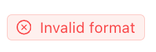
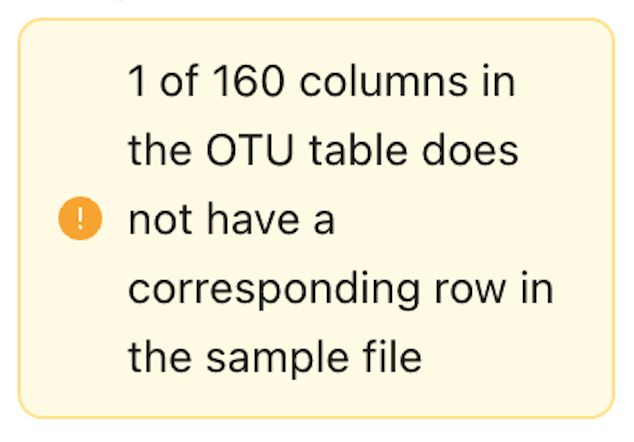

[[trouble]]
== Troubleshooting

This section provides guidance on how to solve common issues that may arise when using the MDT.

[discrete]
=== Log in

All MDTs use the _same https://www.gbif.org/user/profile[user account] as GBIF.org_. +
You need a *password* for your GBIF account. If you signed up with GitHub or Google, click 'Forgot password' on the login page to set up a password.

[discrete]
=== Upload data (step 1)

[discrete]
==== Invalid format

After pressing *Start Upload* a green icon will normally indicate a valid file format (tsv or xlsx).

Contrarily, a red check means that the uploaded file formats are not as expected.

*Potential solutions and explanations*

Ensure that the uploaded files are as required:

_Excel workbooks_

* Only upload one Excel Workbook with all tables as sheets.
* Mandatory names of sheets in workbook: OTU_table, Taxonomy, Samples, and optionally: Study. (Workbook/file can be named anything).
* Can only be combined with a text file with the sequences.

_For text files (tables)_

* Expected names of uploaded tables: OTU_table, Taxonomy, Samples, and optionally: Study. (Taxonomy can be left out if sequences are provided as fasta and no taxonomy is provided).
** If named otherwise, there is a possibility to tell the MDT which file to use as OTU_table, Taxonomy, Samples, and Study.
* Expected file extensions: csv, tsv, txt.
* Expected formatting: tab separated text.
* Can only be combined with a text file with the sequences.

_For fasta file with sequences_

* Expected name and extensions: fa, fas or fasta.
* Expected formatting: Text-based format. Each entry begins with a header line with a greater-than symbol (">") and the OTU ID. The line(s) after contain the actual sequence.
* Can be combined with a set of tabular text files OR one Excel workbook.

[discrete]
==== Lacking correspondence

After uploading warnings will indicate missing correspondence of OTU IDs between OTU_table and Taxonomy table and/or Sample IDs between OTU_table and Samples table.

NOTE: Missing OTUs or Samples (their IDs) from any table means that they (sample or OTU) will be excluded from the final data. This is an easy way of excluding OTUs or Samples – e.g. negative control samples, suspected contaminant species – from the data deliberately.

*Potential checks, solutions and explanations*

* If all the IDs in a dataset lack correspondence between two tables: 
** The field with IDs in the Taxonomy and Samples tables can only be labelled `id`.
** Ensure that your Sample IDs or OTU IDs do not systematically have an appendix or suffix in one of the tables where they occur.

* If only a few of the IDs in a dataset lack correspondence between two tables: 
* Ensure that the all the samples (Sample IDs) you want included in the final dataset are present in both the *OTU_table* and the *Samples* tables, and similarly for the OTUs (OTU IDs), that they are present in both the *OTU_table* and *Taxonomy* tables.

[discrete]
=== Map terms (step 2)

If fields in the *Taxonomy* and *Samples* tables in the uploaded dataset are not identified and mapped automatically, it is likely because they are spelled incorrectly. They can be mapped manually.

If fields and their global values in the *Study* table in the uploaded dataset are not identified and mapped automatically, it is likely because they are spelled incorrectly. But terms/fields can be added manually and provided with a global value. (Misspelled terms in the uploaded *Study* table cannot be mapped manually).

[discrete]
=== Process data (step 3)

[discrete]
=== Review (step 4)

[discrete]
==== Wrong geographical placement of samples

Ensure that you are only using proper decimal degrees for latitude and longitude.

[discrete]
==== The PCoA/MDS looks unexpected

If you have one sample as a clear outlier in the plot and/or most of the samples clumping together, you most likely have one or two samples (or control samples) that have a species/sequence composition that is very different from the other samples. Scrutinizing the sample type/name and the taxonomic composition to judge whether the sample can be considered a normally behaving sample to be included. Otherwise consider deleting the sample from the Samples table and do a new upload. 

[discrete]
=== Export (step 6)

[discrete]
=== Getting logged out

There has been a few instances where Google Chrome users were logged out when pressing *Create DwC*. The exact cause was not identified, but the problem was solved by re-installing Chrome.

[discrete]
=== Publish (processing step 7)

[discrete]
==== Problems publishing DwC-A (from MDT) in IPT

These issues seem to arise if:

* The IPT is not updated to the latest version.
* The DNA-derived extension is not installed on the IPT.

You may need to take the following steps manually (even with an up-to-date IPT):

* Set the basisOfRecord field to "Material Sample."
* Manually select the appropriate licence.

The <<dwc-a>> produced in the MDT can always be validated in the https://www.gbif.org/tools/data-validator[GBIF data validator] to check if the problem is with the archive itself.

<<<