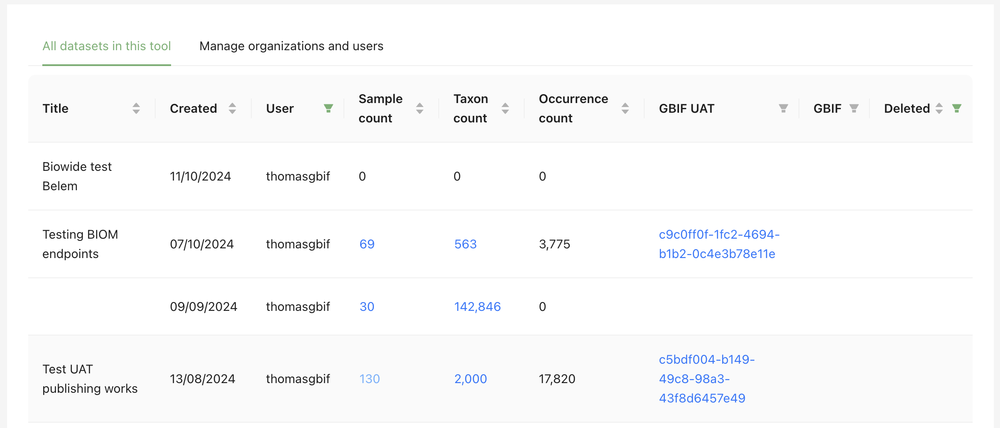
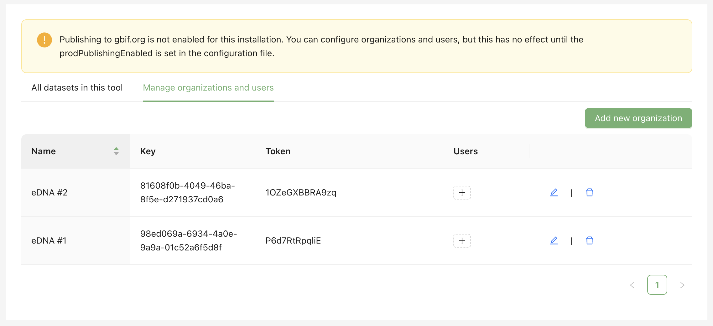
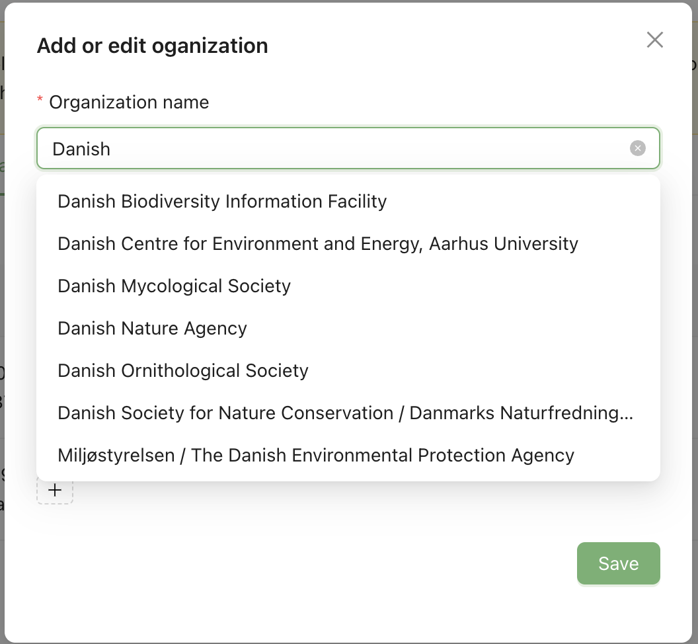
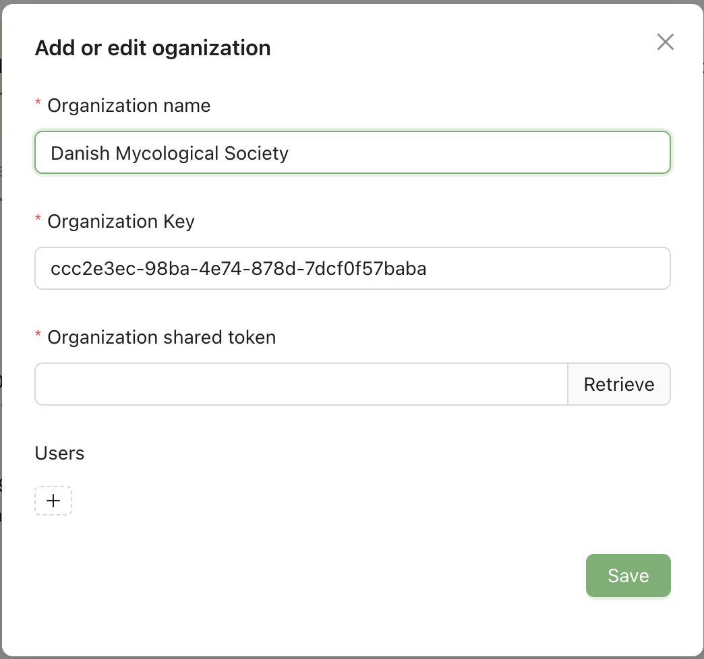

[[admin]]
== Administration

=== Applying for a Hosted MDT

In October 2024, https://www.gbif.org/news/3gm3lJaUQgTKZJRm6TiBff/gbif-nodes-invited-to-join-pilot-for-metabarcoding-data-on-biodiversity[GBIF launched] a pilot phase for the https://www.gbif.org/metabarcoding-data-programme[Metabarcoding Data programme] intended to improve GBIF’s integration of DNA metabarcoding data on biodiversity.

The pilot programme is open to GBIF nodes who wish to administer an MDT. https://www.gbif.org/composition/7o3nbjPcY92vZxmjo6Z8E2/[*Link*] to application form.

=== Configuration Modes (publishing or conversion-only)

The GBIF Secretariat will provide each participating node with a hosted installation of the MDT, providing maintenance and updates as new features and versions are introduced. In recognition of the fact that data sovereignty issues may require some nodes host datasets on servers within their national boundaries, installations can be configured to operate in one of two modes:

****
*Publishing mode*: MDT admins (and users, if given permission) can register datasets for publication through GBIF through the organizations to which they’re associated. Operating in this mode, the MDT functions similarly to an installation of GBIF’s Integrated Publishing Toolkit (IPT) and serves a publishing platform into GBIF.
 
_Unique features_  

* Direct dataset publication to GBIF.org by admins (and users when/if given permision).
* Easy correction, updating, re-mapping, re-annotation of sequences, etc, followed by publication (update).
* Extra BIOM endpoints for improved interoperability and visualization purposes.
****
****
*Conversion-only mode*: MDT admins and users can use it to reshape their datasets into GBIF-ready Darwin Core Archive (DwC-A) files but must download them for hosting and publication on another repository, such as an IPT. This mode may be most appropriate where nodes or data holders have data sovereignty concerns. Unfortunately, this "download-and-publish-elsewhere" procedure, "breaks" most of the user-friendly features of the MDT (see table below). 

_Unique features_

* Final DwC-A _cannot_ be published directly from the MDT, and needs to be downloaded and hosted elsewhere.

****
.Features of the MDT modes
[cols="3,1,1,3", options="header"]
|===
| Feature | Publishing | Conversion | Comments

| Admins can publish directly to GBIF.org
| &#x2705;
| &#x274C;
| 

| Users can be given rights to publish to GBIF.org
| &#x2705; *
| &#x274C;
| *) Admins can opt to withhold publishing rights from users and manage publications themselves

| Datasets can be updated from the MDT
| &#x2705;
| &#x274C; *
| *) For conversion MDTs original input files could be updated, uploaded again, processed, and downloaded as updated DwC-A to replace the previous endpoint wherever it is hosted 

| Datasets on GBIF.org contains the extra endpoint type BIOM_2_1 
| &#x2705;
| &#x274C;
| The BIOM formats ensures better reuse and retains future visualization possibilites

| Dataset on GBIF.org contains the extra endpoint type BIOM_1_0 
| &#x2705;
| &#x274C;
| The BIOM formats ensures better reuse and retains future visualization possibilites

| Retain unmappable fields for potential future re-mapping     
| &#x2705; *
| &#x274C;
| The BIOM format holds all uploaded data fields (incl unmapped fields), and the mapping can thus be extended e.g. when new DwC terms are available

| Dataset can be downloaded and published elsewhere 
| &#x2705; *
| &#x2705; * 
| *) Difficult to update/correct datasets. No BIOM endpoints

| Dataset (endpoint) hosted by GBIF
| &#x2705;
| &#x274C; *
| *) The produced DwC-A will remain in the GBIF hosted MDT unless deleted

|===

=== Workflows 

Both MDT administrators (and users) can start using a hosted MDT immediately. *NB: Administrators typically do not need to take any action until they receive an email from an user of the MDT* – this process (automatic email generation) is explained in detail from the user's perspective in the <<publishing, Publishing Step>> of the <<detailed_guidance>>.

*Basic workflow with a new user*

* A new user (data holder) logs into the MDT with GBIF user account.
* The user uploads a dataset, processes it, and (optionally) publishes it to the test environment (steps 1 to 6). In step 7 (Publish), the workflow is different for MDTs in <<wpm>> and MDTs in <<wcm>>:

[[wpm]]
==== Publishing Mode

In step 7 (Publish), the user selects one of two options, that both initiate an automated email to the MDT administrator:  

[upperalpha]
. "_Ask for access to publish under this institution/organisation_" – in cases where they can find their institution from the drop-down menu. (NB: drop-down pulls from the GBIF Registry).
+
*OR*
+
. "_Ask for help with registering your institution/organisation_"  – in cases where they _cannot_ find their institution from the drop-down menu.

The MDT administrator then recieves an email from the user with relevant information to either:  

[upperalpha]
. Associate the user with the publishing institution/organization in the MDT (see section: <<man_org>>). A link in the email links directluy to the relevant dialogue box for the administrator.  
+
*OR*
+
. Start the procedure of identifying an existing publisher, or start the process of endorsing a new institution/organization as GBIF publisher. And – when this is done – associate the user with this publisher in the MDT (see section: <<man_org>>).

In the mail there is a link to the dataset in the MDT as well as a link to the dataset in the test environment if UAT publication was done.

NOTE: Returning users can upload and publish datasets under any of the publisning institutions/organizations they have been associated with in the MDT.

[[wcm]]
==== Conversion-only Mode

In step 7 (Publish), the user clicks the link "Ready to publish a dataset? Reach out to the administrator for assistance". This will start a preformulated email to the administrator of the MDT, requesting help.

When receiving the email from the user, the MDT administrator can then start the process of ensuring that the user (and/or dataset) is associated with an endorsed GBIF publisher, that the dataset is suitable for publication, and help publishing the prepared DwC Archive through some other procedure (see: <<pub_ipt>>).

=== Administration (section in the menu bar)

Only MDT administrators have access to the *Administration* section. The Administration section has two tabs:

*All Datasets (tab)*

.The *All datasets* tab. Datasets processed beyond step 3 (processing) will have hyperlinks (the Taxon and Sample counts) to simple representations of the dataset. Datasets published to the GBIF test environment (UAT) and/or GBIF.org will have links to those representations. Datasets can be sorted and filtered in various ways.
[.text-center]

[[man_org]]
*Manage Organizations (tab)*

Here the administrator can add new organizations to the MDT. Organizations can also be deleted from the MDT (will not affect the GBIF Registry). Users (GBIF username) can be associated with an organization by pressing the plus (+) sign under Users. This enables users to publish datasets under that organization as publisher.

.The *Manage organizations* tab. Here the administrator can add and delete organizations, users (GBIF username) can be associated with organizations - enabling them to publish.

Organizations already registered in GBIF can be added to the MDT by the admin.

.Press *Add new organization* to add organizations to the MDT. Only organizations already registered (present in the GBIF Registry) in GBIF can be added.

.The Organization Key is automatically added to the form when selecting an organization. *Retrieve the Organization shared token to enable publication for the Organization!*. Pressing *Retrieve* will do this automatically IF the administrator has the required rights in the GBIF Registry. Alternatively, the MDT Administrator needs to retrieve the token by #XXX (contacting helpdesk?)# . Users can be associated with the Organization in the same workflow in the form, or they can be added later (see above).

[[pub_ipt]]
=== Publish through IPT or elsewhere

Administrators of MDTs in conversion-only mode, will need to download the <<dwc-a>> from the MDT and publish them through some other channel.

==== Publish through IPT

The https://www.gbif.org/ipt[Integrated Publishing Toolkit] — commonly referred to as the IPT — is a free open-source software developed by GBIF and used by organizations around the world to create and manage repositories for sharing biodiversity datasets. If you have access to an IPT and know how to use it, you can download the <<dwc-a>> produced by the MDT at the Export (step 6) and publish it through an IPT.

NOTE: By downloading dataset from the MDT and publishing elsewhere, the possibility for easy updating, re-processing and visualization of the dataset in the MDT is lost.

The MDT produces a fully publishable <<dwc-a>> with no need for changes or additions. The archive can validate in the https://www.gbif.org/tool/81281/gbif-data-validator[GBIF data validator].

IPT users/administrators may run into challenges if using older versions of the IPT and/or if the DNA-derived data extension has not been installed. Also there is a known issue that requires the values of the license fields to be set manually.

*Publishing an archive from the MDT via IPT*

* Download the DwC-A (archive.zip) from the MDT.
* login to the IPT.
* Press *Magage Resources*.
* Press *Create new*.
* Give your dataset a *Shortname*.
* Select _Occurrence_ under *Type*.
* Choose *Import from an archived resource*. and select the archive on the computer.
* Press *Create*.
* Validate and verify that the data looks as expected.
* Publish the data as one would normally do in the IPT.

==== Register and host DwC-A elsewhere

A Darwin Core Archive produced with the MDT may be put elsewhere on the web – preferably in a stable repository (e.g. Zenodo, GitHub) – and can then be indexed by GBIF. This requires somebody to register the new resource with GBIF.

* Download the DwC-A (archive.zip) from the MDT.
* Put the archive in a stable repository so you have an URL: www/xxx/archive.zip
* Register the dataset with the relevant publisher in the GBIF registry (#How is that done ?#).
** See e.g. this https://vimeo.com/996575071[video] on sharing to GBIF via APIs.
** See this https://data-blog.gbif.org/post/installations-and-hosting-solutions-explained/[blog post] on general possibilities to publish and host datasets.

<<<