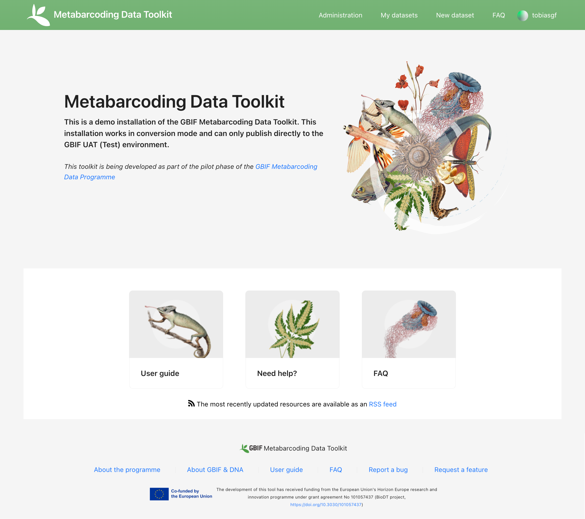
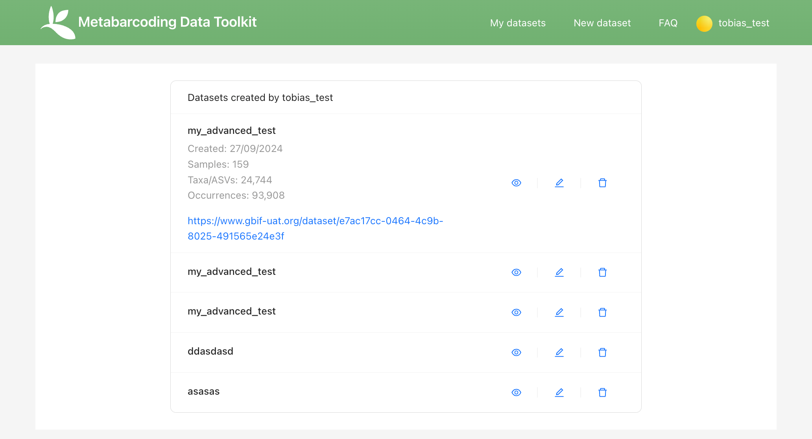
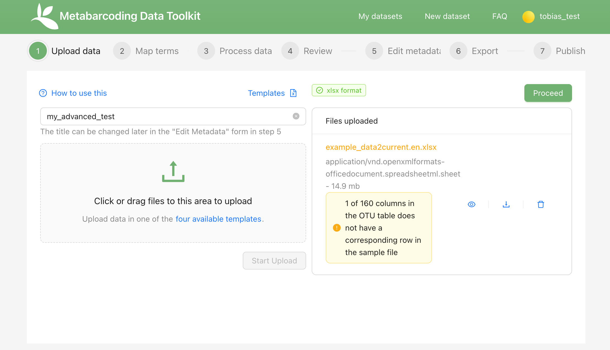
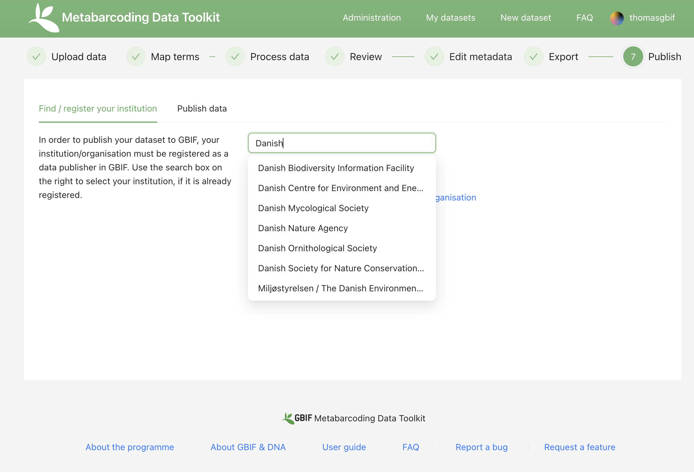
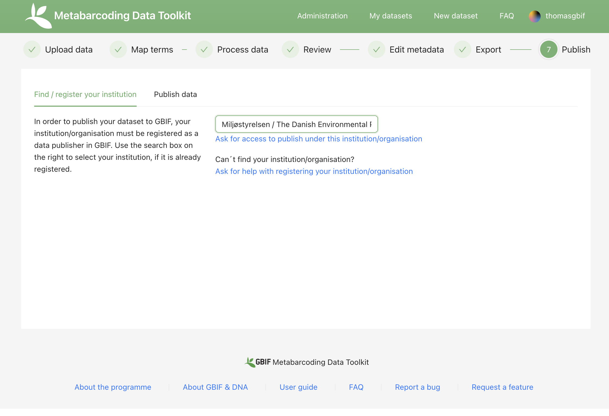

[[detailed_guidance]]
== Detailed user guide

This section provides some extra information on the MDT and the user interface, focussing on uses/aspects/errors that are not "self explanatory" or not already explained in the <<advanced_quick_start>>.

=== Landing page

The landing page (home) is where users access their datasets, start new uploads, etc.

The Menu Bar contains the following items  

* Administration(only visible to MDT managers)
* My datasets
* New dataset: start new data upload/processing from <<dg_upload>>.
* User area (user name): links to: logout, My datasets and Administration (for Managers).

*Administration*

NOTE: This area is only visible and accessible to MDT managers

The tab _All datasets in this tool_ allows managers to see, sort and access datasets in the MDT installation.

image::img/dg_admin_datasets.png[]

The tab _Manage organizations and users_ allows managers to configure organizations and user.

<mark> Add information! </mark>

*My datasets*

In this area users can access the datasets they have uploaded to the MDT.

* Datasets can be opened (eye symbol) and the _Browse_ tab allows to visualize the data similar to the review step, _Metadata_ allows inspection of basic dataset information/metadata, _Files available_ gives access to download standardized BIOM and <dwc-a> files of the dataset (if these have been produced).
* Datasets can be edited. By clicking the pen symbol, the dataset is opened at processing step 1 (Upload data). This allows users to initiate editing of the dataset at any of the processing steps.
+
IMPORTANT: Do not start editing a dataset that is already published on GBIF.org unless you are certain that it requires correction or updating. If you edit a published dataset, you must make the changes effective by publishing an updated Darwin Core Archive (<dwc-a>) through the MDT. Alternatively, if the dataset is published elsewhere, you must update or replace the old <dwc-a> at the respective endpoint. For changes to dataset metadata only (Edit metadata, step 5): Simply create a new <dwc-a> in the Export (step 6) by clicking "Create Darwin Core Archive.", and publish that. For changes in the mapping (step 2) you must also press "Re-process data" in Process data (step 3) to apply the changes, before creating the updated DwC-A and publishing it. For changes to uploaded files (step 1) you must also redo or verify the mapping in step 2.
* Datasets can be deleted (trash symbol). More XX

*Help, feedback and other resources*

* The *Neep help?* (fern leaf): Opens an email to contact the Manager of the MDT installation.
* The *RSS feed*: Lists the most recently updated resources (datasets) available as an RSS feed. This can be used to monitor incoming datasets to the MDT installation.
* The *Report a bug* and *Request a feature* : Opens a GitHub issue where users can report MDT bugs or request MDT features to be developed.

[[dg_upload]]
=== Upload data (processing step 1)

*Files uploaded area*

*The green check above the Files uploaded, is only a basic check of the file type. It is not a check that the dataset is formatted correctly in all aspects.
*The symbols/icons in the Files uploaded area allows to visualize parts of the uploaded tables, delete and download files.

==== Troubleshooting

image::img/dg_invalid_format[][pdfwidth=10%,scaledwidth=10%]

An red check above the Files uploaded area means that the uploaded files are somehow not as expected. Some explanation or orange text below may help interpreting the cause of the error

Suggestions:

* Ensure that the uploaded files are as required:
** For Excel workbooks (one only):
*** Name if workbook not important
*** Expected names of sheets in workbook: OTU_table, Taxonomy, Samples, and optionally: Study
** For text files:
*** Expected names of uploaded files: OTU_table, Taxonomy, Samples, and optionally: Study. (Taxonomy can also be left out if sequences are provided as fasta and no taxonomy is provided)
*** Expected file extensions: csv or tsv (txt ??? xxx)
*** Expected formatting: tab separated text
** For fasta files with sequences:
*** Expected name and extensions: Seqs.fasta
*** Expected formatting: Text-based format. Each entry begins with a header line with a greater-than symbol (">") and the OTU ID. The line(s) after contain the actual sequence.

image::img/dg_no_corresponding.png[pdfwidth=30%,scaledwidth=30%]

A yellow box with some information that a number of sample or OTU IDs are do not have corresponding entries in another table.

Suggestion:

* Ensure that the all the samples (Sample IDs) you want included in the final dataset are present in both the *OTU_table* and the *Samples* tables, and similarly for the OTUs (OTU IDs), that they are present in both the *OTU_table* and *Taxonomy* tables.
* Deleting or leaving out OTUs or Samples (their IDs) from any table means that they will be excluded from the final data. This is thus an easy way of excluding OTUs or Samples – e.g. negative control samples, suspected contaminant species – from the data. There will be warnings during processing.

[[dg_map]]
=== Map terms (processing step 2) 

(<mark> TO BE WRITTEN! </mark>)

See <<advanced_quick_start>> for instructions.

[[dg_process]]
=== Process data (processing step 3)

(<mark> TO BE WRITTEN! </mark>)

See <<advanced_quick_start>> for instructions.

[[dg_review]]
=== Review (processing step 4) 

(<mark> TO BE WRITTEN! </mark>)

See <<advanced_quick_start>> for instructions.

[[dg_metadata]]
=== Edit Metadata (processing step 5) 

(<mark> TO BE WRITTEN! </mark>)

See <<advanced_quick_start>> for instructions.

[[dg_export]]
=== Export (processing step 6)

(<mark> TO BE WRITTEN! </mark>)

See <<advanced_quick_start>> for instructions.

[[publishing]]
=== Publish (processing step 7)

At this step the user options depend on the version (mode) of the MDT used:

* <<pub_host_p,Hosted installations in Publishing mode>>
* <<pub_host_c, Hosted installations in conversion-only mode>>
* <<pub_demo, GBIF demo installation>>

<<pub_host_p>>
==== Hosted installation (publishing mode)

A hosted MDT in publishing mode can publish directly to GBIF.

When you are publishing your first dataset, you will not yet have been associated with a publishing organization. In order to publish your dataset to GBIF, your institution/organisation must be registered as a data publisher in GBIF.

.To publish your first dataset on GBIF, your institution must be registered as a data publisher, and you must be associated with the institution in the MDT.

*Find/register your institution*

* In the *Find/register your institution* tab, use the search box to search for your institution.
* If your institution is already registered:
** select it, and click on "Ask for access to publish under this institution/organisation". This will start a preformulated email to the manager of the MDT, asking to associate you with the institutuion in the MDT.
** Send the mail, and allow some time for the MDT manager to get back you you.
* If you can´t find your institution/organisation:
** Click on "Ask for help with registering your institution/organisation". This will start a preformulated email to the manager of the MDT, asking for help with the steps needed in order to get your institution recognized as a GBIF data publisher, and associate you, so your dataset can be published.
** Add the relevant information about your institution in the mail:
*** INSTITUTION NAME
*** INSTITUTION ADDRESS
*** CONTACT EMAIL
** Send the mail, and allow some time for the MDT manager to get back you you

.If your institution is already registered, select it and request 'access to publish'. If not, ask for 'help with registering'.

<<pub_host_c>>
==== Hosted installation (conversion-only)

The hosted MDT installation in conversion-only mode cannot publish to GBIF.

<mark> NOTE: Section to be written </mark>

<<pub_demo>>
==== GBIF demo MDT installation

The GBIF demo MDT installation cannot publish to GBIF.

If you have processed a dataset in the demo MDT that you would like to publish properly to GBIF.org, you can do the following (<mark> TO BE UPDATED! </mark>):

* Check if there is a suitable hosted MDT installation – e.g. national or regional – that you can use for your dataset.
* If there is a suitable hosted MDT and it is not too much work: reprocess your dataset there.
* Otherwise:
* Write a mail to mailto:dna@gbif.org[dna@gbif.org]. Add the following information in the mail:
** Link to the dataset in the test environment.
** Your UAT login (used in the demo installation).
** Your GBIF login (to be used in hosted installations).
** Your affiliation and country.
** Name of the suitable hosted MDT (if any).
** Explain that you wish your dataset published.

=== Publishing through IPT and other means

==== Publishing through IPT

This publishing procedure may be relevant if you (as a data publisher) cannot have your data in a hosted repository, or if you are the manager of a Hosted MDT installation in conversion-only mode.

The https://www.gbif.org/ipt[Integrated Publishing Toolkit] — commonly referred to as the IPT — is free open-source software developed by GBIF and used by organizations around the world to create and manage repositories for sharing biodiversity datasets. If you have access to an IPT and know how to use it, you can download the <<dwc-a>> produced by the MDT at the Export (step 6) and publish it through an IPT.

By downloading dataset from the MDT and publishing elsewhere, the possibility for easy updating, re-processing and visualization of the dataset in the MDT is lost. Also, archives dowloaded and modified (e.g. in the IPT), will not subsequently be possible to modify or update in the MDT.

The MDT produces fully publishable Darwin Core Archives, with no need for further changes or additions in the IPT. You can check the produced <<dwc-a>> in the https://www.gbif.org/tool/81281/gbif-data-validator[GBIF data validator].

You may run into challenges if you are using older versions of the IPT and/or if the DNA-derived data extension has not been installed. Also there is a known issue that requires the values of the license fields to be set manually.

*Publishing an archive from the MDT via IPT*

* Download the DwC-A (archive.zip) from the MDT.
* login to the IPT.
* Press *Magage Resources*.
* Press *Create new*.
* Give your dataset a *Shortname*.
* Select _Occurrence_ under *Type*.
* Choose *Import from an archived resource*.
* Press *Choose file*, and select your file from the computer.
* Press *Create*.
* Validate and verify that the data looks as expected.
* Publish the data.

*Updating an archive – originally produces in an MDT – in IPT* 

* Update the DNA Metabarcoding dataset (the files uploaded to the MDT)
* Process them in an MDT
* Download the new DwC-A
* Replace the DwC-A in the IPT (<mark>How is that done ?</mark>)

==== Registering an DwC-A hosted elsewhere

A Darwin Core Archive produced with the MDT may be put elsewhere on the web – preferably in a stable repository (e.g. Zenodo, GitHub) – and can then be indexed by GBIF. This requires somebody to register the new resource with GBIF.

*Publishing of an archive from the MDT by hosting elsewhere and registering the resource*

* Download the DwC-A (archive.zip) from the MDT.
* Put the archive somewhere in a stable repository so you have an URL: www/xxx/archive.zip
* Register the dataset with the relevant publisher in the GBIF registry (<mark>How is that done ?</mark>).

[[installations]]
=== Types of MDT installations

Seen from a user perspective there are three different versions of the MDT

*The GBIF DEMO installation*

* Requires login for the GBIF [.underline]#test environment# (UAT).
* Can be accessed here: https://mdt.gbif-uat.org/
* Open for any user.
* MDT users can use it to reshape their datasets into GBIF-ready Darwin Core Archive (DwC-A) files
* DwC-A must be downloaded for hosting and publication on another repository, such as an <<ipt>>.

*Hosted installations in Publishing mode*

* Requires login for GBIF.org.
* Open for any user.
* MDT users can use it to format and register datasets for publication through GBIF through the organizations to which they’re associated.
* This mode functions similarly to an installation of GBIF’s Integrated Publishing Toolkit (IPT).

*Hosted installations in conversion-only mode*
* Requires login for GBIF.org
* Open for any user
* MDT users can use it to reshape their datasets into GBIF-ready Darwin Core Archive (DwC-A) files.
* DwC-A must be downloaded for hosting and publication on another repository, such as an IPT.

IMPORTANT: https://edna-tool.gbif-uat.org/[*the MDT (GBIF eDNA metabarcoding data converter)*] is currently hosted in the GBIF [.underline]#test environment#, and is still a prototype under development. Currently, the MDT can be used to produce a Darwin Core Archive, that can be "published to" and viewed in the https://www.gbif-uat.org/[GBIF test environment (UAT)], but it [.underline]#cannot publish them directly to GBIF.org#.

WARNING: Files uploaded to the MDT and files produced by the MDT are currently stored in the GBIF test environment that cannot be considered a stable repository. Keep a local copy of important files! 

NOTE: the MDT may possibly become a hosted repository, so that endpoints generated by the MDT can be registered with and indexed by with GBIF, OBIS, etc. It may also be a future possibility to be able to publish directly to GBIF.org from the MDT.

TIP: see this https://data-blog.gbif.org/post/installations-and-hosting-solutions-explained/[blog post] on general possibilities to publish and host datasets.