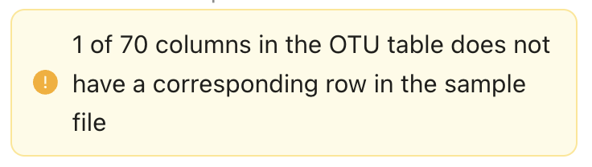

== Advanced Quick Start Guide

This [.underline]#advanced# quick start guide handles the processing of a realistic example dataset with more detailed explanations of the steps and options. You should be able to follow this guide if you already used the simple quick start, but a deeper understanding of all aspects may require further reading about eDNA metabarcoding, dna-derived data, GBIF and Darwin Core data standards. The intention is to familiarize the user with the wider possibilities of THE_TOOL to be able to adapt real datasets for processing in the tool.

NOTE: Some comments and notes are not repeated from the simple quick start.

=== Advanced example dataset

This quick start quide uses a slightly modified version of a real dataset. It is from a eDNA metabarcoding study where DNA was extracted from sea water samples and amplified and sequenced for the 12S gene region. This version has been modified slightly from the original [xxx] to be able to illustrate some features in the tool and workflow, by adding fictional data and some errors.

. Download link:../example_data/example_data2.en.xlsx[example_data_2].
. Save the file to your computer.
. Explore the structure of the template and example data in Excel or another app.
+
NOTE: there is a more detailed description of this example dataset here [XXX].

** The *OTU_table* sheet in the template is the OTU table. Column headers _(BAR.1, BAR.2, BAR.3, ..._) are the IDs of the 69(70) samples in the dataset. Row names (_ASV_1, ASV_2, ASV_3, ..._) are IDs of the 563 OTUs (here ASVs). Cells contain sequence read counts.
** The *Taxonomy* sheet contains the IDs of the 563 OTUs referring to the rownames in the *OTU_table* along with the sequence, and taxonomic information derived from comparing the sequences against NCBI GenBank. NB: Some fields are using DwC terms others are not yet standardised.
** The *Samples* sheet contains the IDs of the 69 samples referring to the column names in the *OTU_table* sheet, and some sample metadata: spatiotemporal data, date, etc. Some fields are using DwC terms others are not yet standardised.
** The *Study* sheet contain "sample/OTU information" that is the same for the whole dataset - e.g.: primer information, sequencing platform.

=== Log into THE_TOOL

. Go to the website of https://edna-tool.gbif-uat.org/[THE_TOOL^].
. Log in
. Press *New Dataset* in the upper part of the page.

=== Upload data (step 1)

. Drag the example dataset to the upload area, or click and select the file.
. Give the dataset a nickname (e.g. "my_advanced_test")
. Press *Start Upload*.
+
A green icon will indicate that the XLSX format is detected and OK according to some very basic data checks.

You will get a warning that one of the columns (samples) in the OTU table does not have a corresponding row in the sample sheet.

. Open the data viewer by clicking on the eye icon next to the uploaded dataset
+ 
Here you can see and verify the structure and content of the four sheets from the uploaded excel file.
. Scroll all the way to the right in the OTU table, and notice that there the last sample called _NEG_, wich is a negative control sample we do not want in the final dataset on GBIF.
. Click on the "Samples" tab, and scroll down and notice that this _NEG_ sample is missing (has been removed on purpose) from the sample sheet. We will leave is like that.
+
NOTE: The tool will only include samples that are present in both *Samples* and *OTU_table*, so a trick to ignore control samples is to remove them just in one place. 
. Close the viewer by pressing *Back*.
. Press *Proceed*

=== Map terms (step 2)

On this page you tell the tool which DwC terms correspond to which fields in the uploaded data.

TIP: Press *how to use this form* to get a guided tour of this page.

TIP: Press *Save mapping* once in a while to make sure that you do not get logged out and lose your work.

*First inspection*

. Inspect the overall structure and information on the page.
.. The upper section named *Sample* maps our sample data fields to Darwin Core terms (first column), automatically identifying and mapping four fields from the *Samples* sheet (second column) and five global fields from the *Study* sheet (third column) with their identically named Darwin Core counterparts.
.. The second section named *Taxon* does the same for taxonomic and sequence related information, auto-mapping four fields from the Taxon sheet to identically named Darwin Core fields.
.. The last section *Unmapped fields* lists all the fields in the uploaded data, that has names the tool do not easily recognize. Below there is an option to put unmapped fields into so-called *Extended Measurement Or Facts*.
. Press "Save Mapping" and see how you get a warning about how some essential fields have not ben mapped.

*Completing the mapping*

Starting from the top with *Sample* information, we see:

* term:dwc[id] was correctly identified and mapped.
* term:dwc[eventDate] was not found in the uploaded data, but the tool suggest to use _date_.
** click on _date_ to make this mapping.
* term:dwc[decimalLatitude] was correctly mapped.
* term:dwc[decimalLatitude] was not found in the uploaded data, and there is no suggestion.
** click on the empty field next to term:dwc[decimalLatitude], and inspect the field names from the uploaded data and notice how the latitude field was simply misspelled _ecimalLatitude_. Select it to make the mapping.
* term:mixs[target_gene] was correctly set to "12S" which was picked from the *Study* sheet containing terms with global values.
* term:mixs[otu_db] also got a value "NCBI nt" from the *Study* sheet.
* term:dwc[island] was mapped to _island_.
* term:mixs[env_medium] and the last terms of the sample section were also automatically were mapped to fields in the *study* sheet.

Now, going down to the *Taxon* section, we see:

* `id` and all the taxonomic levels were mapped automatically.
* term:mixs[DNA_sequence] was not mapped automatically, but it is suggested to use _sequence_.
** click on "sequence" to map that.

Now, going down to *Unmapped fields*, we see a series of fields (_SiteType, Depth, Location, run_accession, sample_accession, salinity_) in the uploaded data, that were not automatically identified and mapped to any Darwin Core terms.

NOTE: A detailed description the fields of the example dataset is in the section XXX.

We expect (or know) that Darwin Core can accomodate several of these un-mapped fields, and we also want to supply some global information (e.g. country), which was not included in the uploaded data.

. Go to the last part of the *Sample* section.
. Click on *Add mapping for another sample field* and look at the list of available terms.
. We wish to find some standard field to map to our field _Location_.
.. start typing "Loca" and select term:dwc[verbatimLocality].
.. click *Add field*, and see how the field is added to the list of terms.
.. Now, select our field _Location_ to map it.
. Now, we wish to map the fields with information on the corresponding sequencing files in INSDC (ENA/SRA), and follow the GBIF recommendations for which fields to use for this purpose:
.. Find and add the term term:dwc[associatedSequences] and map it to our field _run_accession_.
.. Find and add the term term:dwc[materialSampleID] and map it to our field _sample_accession_.
. To make the dataset more well documented, we will include some information that we have, but was not included in the upload.
.. All sample were from Ecuador. Add the term term:dwc[country] and type "Ecuador" in the *Add default value*.
.. We also know that all samples were from the upper layers of oceanic water.
... Add the term term:mixs[env_broad_scale].
... see how it is possible to browse the ENVO Ontology. Click and search for "epipelagic" and select the "oceanic epipelagic zone biome" with OBO ID "ENVO:01000035".
+
NOTE: this is also how the term term:mixs[env_medium] (above) is filled out from the same ontology, but this was supplied in the uploaded data.

Now, going down to *Unmapped fields*, we see that only a few fields remain unmapped. We really want to map _salinity_, but there is no standard field for that. So we will put that into *Extended Measurement Or Facts*.

. click on *salinity* from the row of unmapped fields and see how it is transferred to the the section below as a new entry.
. We know that the measurement unit is "PSU", so we add that manually.

Now, the mapping is complete.

NOTE: All available standard fields (from Occurrence Core, and the dna-derived extension) can be included in the upload files, and if spelled correctly no manual mapping is needed.

. Press *Proceed*.

=== Process data (step 3)

. Press *Process data*.
+
The tool goes through a series of steps which will be indicated as succesful with a green tick-mark, and finally produces standardized BIOM files, which the tool uses as an intermediate file format.
+
NOTE: You will get a warning that "NEG in the OTU table are not present in the SAMPLE table". We already knew that and kept it like that to exclude this negative control from the final data.
+
NOTE: The option *assign taxonomy* uses the https://www.gbif.org/tools/sequence-id[GBIF Sequence ID tool^] to assign taxonomy to the OTUs by comparing the sequences with a reference database. This overwrites any taxonomy provided in the data. If you wish to try it here, you will see that the current 12S reference database cannot assign taxonomy to a number of the sequences in this dataset project (all the non-fish). This guide assumes that you used the taxonomy in the uploaded data.

. Check that number of samples and taxa are as expected (here: 69 samples and 563 taxa).
. Press *Proceed*

=== Review (step 4)

Here the data can be explored to check that everything is OK. The options in this step are intended as sanity checks of the data to ensure that e.g. negative control samples have been removed, and that the mapping is as expected.

. Check the data.
** Check the map and verify that the samples are placed geographically where expected (Around Galapagos Islands).
** Check the taxonomic barchart to ensure that taxonomic composition is as expected.
*** try some of the other options (e.g. Absolute read abundance).
** Check ordination plots (PCoA/MDS) – that visualise compositional differnence of the samples – for outliers (any control samples that should have been excluded?).
** Select single samples from the map or from charts and explore their metadata and taxonomy in the panel to the right.
. Press *Proceed*

=== Add metadata (step 5)

On this page, dataset metadata (dataset description, persons and affiliations, etc.) is added in a minimalistic form.

TIP: toggle "Show help" to get guidance text for the fields.

. Add a meaningful title (e.g. “Fish and other vertebrates detected in sea water from the sea around Galapagos Islands, Ecuador; inferred from 12S DNA metabarcoding data with primers targeting elasmobranch.”).
. Select a licence (e.g. CC0).
. Give as rich a dataset description as you can (here just add some random text as you please).
. Add contact information - minimum is email and orcid.
+
NOTE: use e.g. 1111-2222-3333-123X as dummy orcid if you wish.
. Fill out the other fields as good as possible (or leave them empty for now).
. Press *Proceed*.

=== Export (step 6)

This last page of the process produces a Darwin Core Archive that can be published directly to the https://www.gbif-uat.org/[GBIF test environment (UAT)^] from THE_TOOL. This archive can also be published properly to GBIF.org eventually.

. Press *Create DWC archive*.
+
This creates the Darwin Core Archive from the data, going through a series of steps, that will be indicated as succesful with a green tick-mark.
. Press *Publish to GBIF test environment (UAT)*.

A prompt will inform that it takes some minutes before the data is fully ingested and will show up with all samples in the GBIF test environment (and the map will only appear the next day). A link to the dataset in the test environment will appear next to the *Publish* button.

. Explore the dataset in the test environment
. Ensure that all information and data is processed and displayed appropriately.

You should now have an good idea of how the tool works and how you may adapt your own datasets to the template and use THE_TOOL.

Be sure to check the best practices from the Detailed User Guide below.

NOTE: If you end up with a dataset suitable for publication to GBIF.org, go to <<publishing_to_gbif>>.
