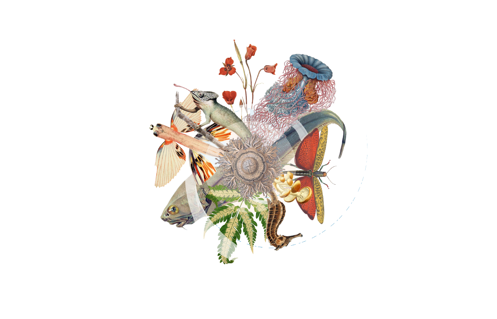

// add cover image to img directory and update filename below
ifdef::backend-html5[]

endif::backend-html5[]

== Colophon

=== Suggested citation

Frøslev TG, Jeppesen TS. The guide to THE_TOOL. GBIF Secretariat: Copenhagen. 
// Uncomment once a DOI is assigned
//https://doi.org/10.EXAMPLE/EXAMPLE

=== Authors

https://orcid.org/0000-0002-3530-013X[Tobias G Frøslev] & https://orcid.org/0000-0003-1691-239X[Thomas S Jeppesen]

=== Contributors

XXX

=== Licence

The document _Guide to THE_TOOL_ is licensed under https://creativecommons.org/licenses/by-sa/4.0[Creative Commons Attribution-ShareAlike 4.0 Unported License].

=== Persistent URI

#TODO: Assign a DOI before publication#
// Uncomment once a DOI is assigned
//https://doi.org/10.EXAMPLE/EXAMPLE

=== Document control

First edition, April 2020

// include reference to provenance if possible/relevant
https://doi.org/10.EXAMPLE/2ND-EXAMPLE[Second edition], March 2015, by Due Autore and https://orcid.org/0000-0000-0000-0000[Troisième Auteur].

Originally based on an earlier publication, _Towards establishing the special guide to something_.

=== Cover image

// Caption. Credit, source, licence.

