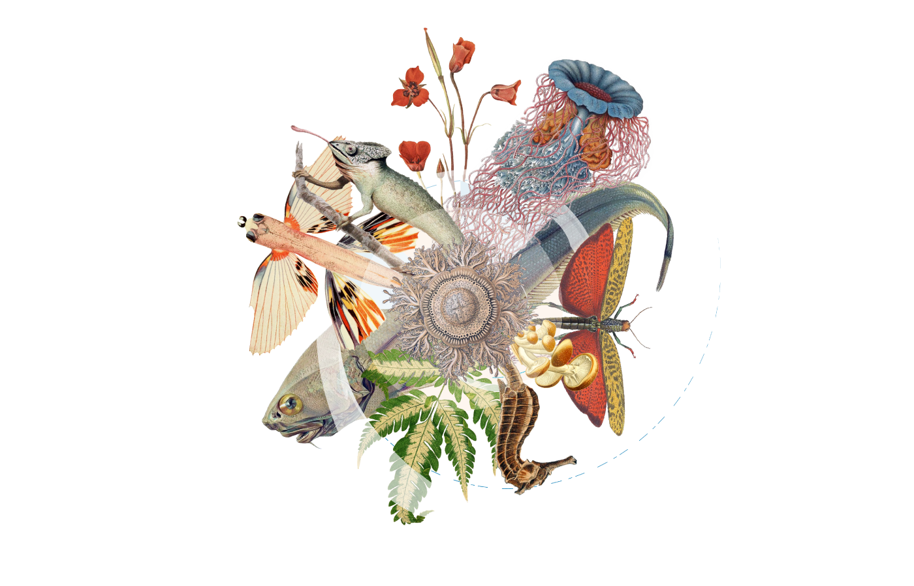

ifdef::backend-html5[]

endif::backend-html5[]

== Colophon

=== Suggested citation

GBIF Secretariat (2024) Metabarcoding Data Toolkit - user guide. Copenhagen: Global Biodiversity Facility. https://doi.org/10.35035/doc-wkpc-m352

=== Licence

The document _Metabarcoding Data Toolkit - user guide_ is licensed under https://creativecommons.org/licenses/by-sa/4.0[Creative Commons Attribution-ShareAlike 4.0 Unported License].

=== Persistent URI

https://doi.org/10.35035/doc-wkpc-m352
