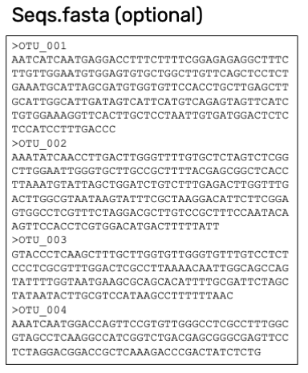

== Dataset preparation and dataset structure

In this section you will find detailed information and best practices on how to prepare and structure datasets for uploading and processing.

NOTE: illustrations (screenshots) may be slighlty different from what you see in the online tool, as THE_TOOL is still being developed and improved.

=== The OTU table

The tool accepts data in a format familiar to the eDNA metabarcoding community - the OTU table.

The OTU table is a specialized version of a species/site matrix, which is a standard way to organize data in biodiveristy and ecology studies, summarizing the presence and abundance of different organisms across various samples. In an OTU table each row represents a unique OTU, and each column represents a different sample or site, with the cell values indicating the count of sequencing reads of the OTUs in each sample. An OTU table may also have OTUs as columns and samples as rows. Here, we are using the term OTU broadly to cover also ASVs and other types of representative sequences resulting from bioinformatic processing of raw sequencing data from DNA metabarcoding.

The two dimensions (columns and rows) of the central OTU table is most often associated with two other tables:

* One relating to the samples, e.g. geographical position and sampling date.
* One relating to the OTUs: at least the sequence, but likely also taxonomy.

image::img/OTU_table_all_filed.png[]
.The OTU table (example dataset 1). A minimalistic example of an *OTU_table* with 5 samples (Sample_A, Sample_B,..) as columns and 4 OTUs (OTU_001, OTU_002,..) as rows. Green boxes and arrow indicate the linking of the OTUs by their IDs to second table *Taxonomy* with taxonomic/sequence data data. Blue boxes and arrow indicate the the linling of samples by their IDs to the third table *Samples* with and sample metadata. The optional *Study* and *Seqs.fasta* are explained below. 

NOTE: 
It is commonly seen that an OTU_table with OTUs as rows has taxonomic information of the OTUs (sequence, kingdom, phylum, etc) added as extra columns. More rarely we see that sample metadata (position, sampling date, soil ph, etc) is added as extra columns to an OTU_table having samples as rows.

Most analysed datasets from DNA metabarcoding will be possible to fit into this three-table format.

To be able to publish biodiversity data in GBIF, the data needs to be formatted as a list of occurrences. As this reshaping can be error prone and complicated, THE_TOOL has been build to automate this process. In other terms we use the OTU table as a publishing model, targeting a familiar data format of this research community. 

With THE_TOOL there is provided number of dataset templates. They all contain 3-4 tables (as sheets in an Excel workbook or as separate tsv/csv files) and potentially a separate file with the sequences:

* *OTU_table*: The table (matrix) of sequence read counts of each OTU in each sample
* *Taxonomy*: a table of the sequences and potentially their taxonomy, and rarely much more, as relevant metadata (sequencing platform, primers) can be put into the *Study* table.
* *Samples*: a table of the metadata associated with the samples. This table is where all the metadata with different values for each sample is placed (geography, sampling date, etc.).
* *Study*: this (optional) fourth table contain only two columns (term, value). This table can be used for metadata (terms) with values that are the same for the whole dataset ("global values") – often that would be things like: target gene, primer information, sequencing platform, pipeline, extraction procedure, etc.
* *Seqs.fasta*: this (optional) file may contain the sequences of the OTUs instead of having them as a field in the *Taxonomy* table. 

=== Preparing a dataset

==== Basic checks

* The data is DNA metabarcoding data (amplified and sequenced marker genes) and not something else (metagenomics, specimen barcoding, qPCR)
* You have access to the processed data as OTU table and associated table (and not just access to the raw un-amalysed sequence data - e.g. fastq files)
* You are allowed to share the data in GBIF.
* You have the most essential data available
** location, date for the samples
** sequences of the OTUs/ASVs
** an OTU table with number of sequence reads of each OTU in each sample
** some information that allows you to contruct a dataset description
** information on the persons that should be associated as creators and contacts for the dataset. 

==== Select a template

Select one of the available data structures (templates) that is suitable for your data.

* If you prefer Excel workbooks, then use template 1 og 2.
* If you prefer tab (or comma) separated text files, go for template 3 or 4. 
* If you have the sequence reads as a separate fasta file, then use template 2 or 4.

==== Fit the data into the template

Now try to fit the data into the selected template and provide as many as the  <<recommended, required and recommended fields>>.

TIP: The order (sorting) of rows and columns in tables is not important. 

*OTU_table*

* Fit your data into an *OTU_table* with samples as columns and OTUs as row.
* Remove rows and columns that are not samples and OTUs.
** No rows or columns with sums/totals.
** No columns with sample or taxomomy data, move that to a separate table/sheet.
* Use 0 (zero) in cells without a read count (not "NA", "-" or similar).
* Make sure that samples IDs (column headers) are unique, and prefarably do not contain a lot of unstandardized [XXX] characters.
* Make sure that OTU IDs (row names) are unique, and prefarably do not contain a lot of unstandardized [XXX] characters.
* Leave the upper left cell empty.
+
NOTE: This table does not hold any DwC fields/terms

*Taxonomy*

* Fit your OTU data into a *Taxonomy* table with OTUs as rows and associated data as columns.
* First colums should be `id` and contain OTU IDs referring to (identical to) the row names in the *OTU_table*.
* Normally this table would not contain a lot of fields, only those that relate to the single OTUs and carry different values per OTU:
** The sequence (as term:dwc[DNA_sequence]) unless these are provided in a separate fasta file.
** Taxonomy inferred from comparing the sequences againat a reference database
*** This can be given as a XXXX
+
NOTE: most metadata related to sequences (sequencing platform, primers, etc) is identical for all samples and OTUs, and these can be uploaded in the fouth table *Study* with "global" values. 
* Use Darwin Core terms for your fields to minimize manual mapping in later steps.

*Samples*

* Fit your Sample metadata into a *Sample* table with Sample IDs as rows and associated data as columns.
* First colums should be `id` and contain Sample IDs referring to (identical to) the column names in the *OTU_table*.
* This table is where you fit all the metadata related to the single samples if the values are different between samples
** Sampling locations
** Sampling dates
** Physical properties related to the sample (e.g. pH)
** Links to sample-associated data elsewhere – e.g. raw sequence data and biosample record in INSDC.
* Be sure to include as many of the required and recommended fields as possible (see below).
* There are many more fields to select from in the Occurrence Core (LINK) and dna-derived extension (link).
+
TIP: Use *Study* table for fields/terms that does not differ between samples.
* Use Darwin Core terms for your fields to minimize manual mapping in later steps. 

*Study* (optional)

The use of this table is optional. But as many data fileds are often applicable to the whole study, we recommend to use this table (as opposed to have the same fields in the *Samples* table with identical values for all entries.

* Fit all metadata fields with global values (same value for all samples and/or OTUs) into this table.
* the table has two columns (_term_, _value_). Each row holds any term from Darwin Core (incl the dna-derived extension) in the _term_ field, and the corresponding _value_ contains the value relevant for this study (see minimal example below).
* Be sure to include as many of the required and recommended fields as possible (see below).
* Use Darwin Core terms for your fields to minimize manual mapping in later steps.

*Seqs.fasta* (optional)

In some metabarcoding datasets, the sequences are placed in a separate https://en.wikipedia.org/wiki/FASTA_format[fasta file^]. This is also possible here. If this option is chosen, then a few checks are good.

* Make sure you follow the classic fasta formatting. A sequence begins with a greater-than character (">") followed by the OTU ID. The lines immediately following this header line are the sequence representation (ACTG...). The next ">" marks the beginning of the next sequence.
* OTU IDs are used as headers in the fasta file.
* OTU IDs should be the same as those in the OTU table.

*Dataset descriptions, people and other metadata*

Before starting the data upload and processing in THE_TOOL it is a good idea to prepare a dataset description, collect information on the people you need to associate with the data, etc.

You need to prepare:
* A dataset title. Choose something descriptive. Examples:
** XXX
** XXX
** XXX
* A dataset description. XXXX
* Persons that should be associated with the dataset. This could be the authors of an associated research paper, the laboratory personnel, the person preparing the dataset for GBIF publication, etc.
** Name
** Affiliation
** Address
** email
** orcid
* All persons added will be listed as authors in the suggested dataset citation.
* Be sure to designate one of the persons (you?) as the contact person. This is the person that will be contacted if e.g. users find issues in the data.
* Associated ressources ???

NOTE: THE_TOOL uses a simple form for providing this dataset metadata. This is intentional as we do not wish the demotivate users by confronting them with a form with many options only marginally relevant for DNA metabarcoding data. If you chose to publish the processed data through an IPT, you will have the possibility of adding metadata there.

=== Required and recommended fields [[recommended]]

This section contains a list of required and recommended fields. These tables are modified/specialized version of tables xxx in the dna-publishing guide xxx specifically for when using THE_TOOL. 

When using THE_TOOL it is not important to know whether the fields you are using are from Occurrence Core or the dna-derived extension. But it is important to know in which table to put the fields and associated values. The *Placement* column explains where to provide each field. A lot of the required and recommended fields are automatically handled/calculated, and do should not be provided by the user – *Placement* informs about this also.

NOTE: many of the fields relating to taxonomy/sequences (e.g. primers, reference database) should be possible to give as global values in the *Study* table. If you find that this is not the case, you may be dealing with a mixed dataset, with sequences from more than one primer set (e.g. COI and 16S sequences from the same set of samples). We recommend to publish such datasets separately.

[[table-01]]
.Recommended fields for http://rs.gbif.org/core/dwc_occurrence_2020-04-15.xml[Occurrence core] for Metabarcoding data. This table is a modified version of table xxx in the dna-publishing guide xxx specifically for using THE_TOOL.
[cols="1,1,4,1,1",options="header"]
|===
| Field name
| Examples / explanation
| Description
| Required
| Placement

| term:dwc[basisOfRecord]
| _This field is is automatically set as "Material Sample" by the tool_
| The specific nature of the data record - a subtype of the http://rs.gbif.org/vocabulary/dwc/basis_of_record.xml[dcterms:type].
| Required
| _Automatic by tool_

| term:dwc[occurrenceID]
| _This field is automatilly contructed by the tool as "eventID:OTU_id"_
| A unique identifier for the occurrence, allowing the same occurrence to be recognized across dataset versions as well as through data downloads and use.
| Required
| _Automatic by tool_

| term:dwc[eventID]
| _This field is automatically set to the IDs of the Sample_
| An identifier for the set of information associated with an Event (something that occurs at a place and time).
| Highly recommended
| _Automatic by tool_

| term:dwc[eventDate]
| 2020-01-05
| Date when the event was recorded. Recommended best practice is to use a date that conforms to ISO 8601-1:2019. For more information, check https://dwc.tdwg.org/terms/#dwc:eventDate
| Required
| *Samples* (or *Study*)

| term:dwc[recordedBy]
| "Oliver P. Pearson \| Anita K. Pearson"
| A list (concatenated and separated) of names of people, groups, or organizations responsible for recording the original Occurrence. The recommended best practice is to separate the values with a vertical bar (' \| '). Including information about the observer improves the scientific reproducibility (https://doi.org/10.1093/database/baaa072[Groom et al. 2020^]).
| Highly recommended
| *Samples* or *Study*

| term:dwc[organismQuantity]
| _This field is automatically filled with the value from the corresponding cell in the uploaded OTU table_
| Number of reads of this OTU or ASV in the sample.
| Highly recommended
| _Automatic by tool_

| term:dwc[organismQuantityType]
| _This field is automatically filled with the value "DNA sequence reads"_
| Should always be “DNA sequence reads”
| Highly recommended
| _Automatic by tool_

| term:dwc[sampleSizeValue]
| _This field is automatically filled total number of reads in the sample as calculated by the tool automatically_
| Total number of reads in the sample. This is important since it allows calculating the relative abundance of each OTU or ASV within the sample.
| Highly recommended
| _Automatic by tool_

| term:dwc[sampleSizeUnit]
| DNA sequence reads
| _This field is automatically filled with the value “DNA sequence reads”_
| Highly recommended
| _Automatic by tool_

| term:dwc[materialSampleID]
| https://www.ncbi.nlm.nih.gov/biosample/15224856 +
 +
https://www.ebi.ac.uk/ena/browser/view/SAMEA3724543 +
 +
urn:uuid:a964805b-33c2-439a-beaa-6379ebbfcd03
| An identifier for the MaterialSample (as opposed to a particular digital record of the material sample). Use the biosample ID if one was obtained from a nucleotide archive. In the absence of a persistent global unique identifier, construct one from a combination of identifiers in the record that will most closely make the materialSampleID globally unique.
| Highly recommended
| *Samples*

| term:dwc[samplingProtocol]
| UV light trap
| The name of, reference to, or description of the method or protocol used during a sampling Event. https://dwc.tdwg.org/terms/#dwc:samplingProtocol
| Recommended
| *Study* (or *Samples*)

| term:dwc[associatedSequences]
| https://www.ebi.ac.uk/ena/browser/view/ERR1202046
| A list (concatenated and separated) of identifiers (publication, global unique identifier, URI). For most cases it woule be linking to archived raw metabarcoding read files in a public repository.
| Recommended
| *Samples*

| term:dwc[identificationRemarks]
| RDP annotation confidence (at lowest specified taxon): 0.96, against reference database: GTDB
| Specification of taxonomic identification process, ideally including data on applied algorithm and reference database, as well as on level of confidence in the resulting identification.
| Recommended
| *Study* (or *Taxonomy*)

| term:dwc[identificationReferences]
| https://www.ebi.ac.uk/metagenomics/pipelines/4.1 + 
 +
https://github.com/terrimporter/CO1Classifier
| A list (concatenated and separated) of references (publication, global unique identifier, URI) used in the Identification. Recommended best practice is to separate the values in a list with space vertical bar space ( \| ).
| Recommended
| *Study* (or *Taxonomy*)

| term:dwc[decimalLatitude]
| 60.545207
| The geographic latitude (in decimal degrees, using the spatial reference system given in geodeticDatum) of the geographic centre of a Location. Positive values are north of the Equator, negative values are south of it. Legal values lie between -90 and 90, inclusive.
| Highly recommended
| *Samples* (or *Study*)

| term:dwc[decimalLongitude]
| 24.174556
| The geographic longitude (in decimal degrees, using the spatial reference system given in geodeticDatum) of the geographic centre of a Location. Positive values are east of the Greenwich Meridian, negative values are west of it. Legal values lie between -180 and 180, inclusive.
| Highly recommended
| *Samples* (or *Study*)

// The [.break-all]#ASV:…# is to allow the identifier to be broken at any character, rather than stretching the text cell.
| term:dwc[taxonID]
| _This field is automatically filled with an MD5 hash of the sequence – e.g. [.break-all]#ASV:7bdb57487bee022ba30c03c3e7ca50e1#_
| For eDNA data, it is recommended to use an MD5 hash of the sequence and prepend it with “ASV:”. See also <<taxonomy-of-sequences>>.
| Highly recommended
| _Automatic by tool_

| term:dwc[scientificName]
| _Gadus morhua_ L. 1758, BOLD:ACF1143
| Scientific name of the closest known taxon (species or higher) or an OTU identifier from BOLD (BIN) or UNITE (SH)
| Required (filled with "Incertae sedis" if left blank)
| *Taxonomy*

| term:dwc[kingdom]
| Animalia
| Higher taxonomy
| Highly recommended
| *Taxonomy*

| term:dwc[phylum]
| Chordata
| Higher taxonomy
| Recommended
| *Taxonomy*

| term:dwc[class]
| Actinopterygii
| Higher taxonomy
| Recommended
| *Taxonomy*

| term:dwc[order]
| Gadiformes
| Higher taxonomy
| Recommended
| *Taxonomy*

| term:dwc[family]
| Gadidae
| Higher taxonomy
| Recommended
| *Taxonomy*

| term:dwc[genus]
| _Gadus_
| Higher taxonomy
| Recommended
| *Taxonomy*

|===

<<<

[[table-02]]
.Recommended fields from the DNA derived data extension (a selection) for metabarcoding data
[cols="1,1,4,1,1",options="header"]
|===
| Field name
| Examples
| Description
| Required
| Placement

// The [.break-all]#TCTA…# is to allow the sequence to be broken at any character, rather than stretching the text cell.
| term:mixs[DNA_sequence]
| [.break-all]#TCTATCCTCAATTATAGGTCATAATTCACCATCAGTAGATTTAGGAATTTTCTCTATTCATATTGCAGGTGTATCATCAATTATAGGATCAATTAATTTTATTGTAACAATTTTAAATATACATACAAAAACTCATTCATTAAACTTTTTACCATTATTTTCATGATCAGTTCTAGTTACAGCAATTCTCCTTTTATTATCATTA#
| The DNA sequence (ASV). Taxonomic interpretation of the sequence depends on the technology and reference library available at the time of publication. Hence, the most objective taxonomic handle is the sequence which can be reinterpreted in the future.
| Required (Highly recommended)
| *Taxonomy* or in separate fasta file (*Seqs.fasta*)

| term:mixs[sop]
| https://www.protocols.io/view/emp-its-illumina-amplicon-protocol-pa7dihn
| Standard operating procedures used in assembly and/or annotation of genomes, metagenomes or environmental sequences. +
 +
A reference to a well documented protocol, e.g. using https://protocols.io[protocols.io]
| Recommended
| *Study*

| term:mixs[target_gene]
| 16S rRNA, 18S rRNA, ITS
| Targeted gene or marker name for marker-based studies
| Highly recommended
| *Study*

| term:mixs[target_subfragment]
| V6, V9, ITS2
| Name of subfragment of a gene or markerImportant to e.g. identify special regions on marker genes like the hypervariable V6 region of the 16S rRNA gene
| Highly recommended
| *Study*

| term:mixs[pcr_primer_forward]
| GGACTACHVGGGTWTCTAAT
| Forward PCR primer that was used to amplify the sequence of the targeted gene, locus or subfragment.
| Highly recommended
| *Study*

| term:mixs[pcr_primer_reverse]
| GGACTACHVGGGTWTCTAAT
| Reverse PCR primer that was used to amplify the sequence of the targeted gene, locus or subfragment.
| Highly recommended
| *Study*

| term:mixs[pcr_primer_name_forward]
| jgLCO1490
| Name of the forward PCR primer
| Highly recommended
| *Study*

| term:mixs[pcr_primer_name_reverse]
| jgHCO2198
| Name of the reverse PCR primer
| Highly recommended
| *Study*

| term:mixs[pcr_primer_reference]
| https://doi.org/10.1186/1742-9994-10-34
| Reference for the primers
| Highly recommended
| *Study*

| term:mixs[env_broad_scale]
| forest biome [ENVO:01000174]
| *Equivalent to env_biome in MIxS v4* +
In this field, report which major environmental system your sample or specimen came from. The systems identified should have a coarse spatial grain, to provide the general environmental context of where the sampling was done (e.g. were you in the desert or a rainforest?). We recommend using subclasses of ENVO’s biome class: +
http://purl.obolibrary.org/obo/ENVO_00000428
| Recommended (ENVO can be browsed and selected interactively in tool)
| *Samples*

| term:mixs[env_local_scale]
| litter layer [ENVO:01000338]
| *Equivalent to env_feature in MIxS v4* +
In this field, report the entity or entities which are in your sample or specimen´s local vicinity and which you believe have significant causal influences on your sample or specimen. Please use terms that are present in ENVO and which are of smaller spatial grain than your entry for env_broad_scale.
| Recommended (ENVO can be browsed and selected interactively in tool)
| *Samples*

| term:mixs[env_medium]
| soil[ENVO:00001998]
| *Equivalent to env_material in MIxS v4* +
In this field, report which environmental material or materials (pipe separated) immediately surrounded your sample or specimen prior to sampling, using one or more subclasses of ENVO´s environmental material class: +
http://purl.obolibrary.org/obo/ENVO_00010483
| Recommended (ENVO can be browsed and selected interactively in tool)
| *Samples*

| term:mixs[lib_layout]
| Paired
| *Equivalent to lib_const_meth in MIxS v4* +
Specify whether to expect single, paired, or other configuration of reads
| Recommended
| *Samples*

| term:mixs[seq_meth]
| Illumina HiSeq 1500
| Sequencing method/platform used
| Highly recommended
| *Study*

| term:mixs[otu_class_appr]
| "dada2; 1.14.0; ASV"
| Approach/algorithm and clustering level (if relevant) when defining OTUs or ASVs
| Highly recommended
| *Study*

| term:mixs[otu_seq_comp_appr]
| "blastn;2.6.0+;e-value cutoff: 0.001"
| Tool and thresholds used to assign "species-level" names to OTUs or ASVs
| Highly recommended
| *Study*

| term:mixs[otu_db]
| "Genbank nr;221", "UNITE;8.2"
| Reference database (i.e. sequences not generated as part of the current study) used to assigning taxonomy to OTUs or ASVs
| Highly recommended
| *Study*
|===

<<<
